# Projeto Conceitual de Software

- [Explicações adicionais](https://drive.google.com/file/d/1WWIz6609c7Y7zAQRBWHSbX0t2vEJ2z1A/view?usp=sharing)
- [Noções de UML](https://drive.google.com/file/d/1l1yt2ittHuRKIXVXYT76P1HriR07pK-t/view?usp=sharing)
- [Requisitos](https://engsoftmoderna.info/cap3.html)

> **Itens fundamentais:**
> - **Diagrama Atividades UML:** descrever e explicar o fluxo do comportamento funcional do produto proposto, evidenciando, de forma clara e estruturada, como as atividades são executadas, em que ordem e sob quais condições. Esse diagrama permite compreender o funcionamento dinâmico do sistema, destacando:
>   - os principais atores (usuários ou sistemas externos) envolvidos no processo;
>   - as atividades de negócio realizadas por cada ator ou pelo próprio sistema;
>   - os insumos (entradas) necessários para a execução das atividades;
>   - os resultados (saídas) gerados ao longo do fluxo;
>   - os pontos de decisão, paralelismo e sincronização das atividades;
>   - Entre as notações mais relevantes, destacam-se o estado inicial e final, atividades, nós de decisão e junção, barras de bifurcação, Raias (*swimlanes*) e Fluxos de controle.
> - **_Backlog_ do Produto**
>   - Detalhar os requisitos funcionais (RF) com a técnica de documentação e especificação de história de usuário (HU);
>   - Protótipos de interface gráfica do *software* em alta fidelidade.
>     - **Todas HUs devem conter sua descrição (Eu-Como-Para), critérios de aceitação e protótipos de interface, documentadas no github.**
>   - Exporte as informações do Backlog do Produto no GitHub Projects [em formato CSV](https://docs.github.com/en/issues/planning-and-tracking-with-projects/managing-your-project/exporting-your-projects-data), e [renderize em Markdown](https://www.google.com/search?q=convert+CSV+file+to+Markdown+table) no formato a seguir:

### Requisitos Funcionais

<u>RF-00/Épico-00: Título do RF/Épico</u>

| ID (Link Github Projects) | Título | Prioridade |
|:------| :-- | :--- |
| HU-00 | | |
| HU-01 | | |
| HU-02 | | |

<u>RF-01/Épico-01: Título do RF/Épico</u>

| ID (Link Github Projects) | Título | Prioridade |
|:--------------------------| :-- | :--- |
| HU-03                     | | |
| HU-04                     | | |
| HU-05                     | | |

### Requisitos Não-Funcionais

| ID (Link Github Projects) | Título | Prioridade | Rastreabilidade |
|:--------------------------| :-- | :--- |:----------------|
| RNF-01                    | | | RF-00/HU-00     |
| RNF-02                    | | |                 |
| RNF-03                    | | |                 |

> 
> - **Descrição da arquitetura da solução de _software_ proposta:**
>   - Esta subseção deve contemplar o documento de arquitetura do sistema e deve ser estruturado segundo as visões (4+1) previstas no processo unificado (UP): lógica, de processos; implementação, implantação e dados (substituirá a visão de casos de uso).
>   - Propósito do *software* (qual o seu papel no sistema);
>   - Padrão adotado: MVC, MVP, Microsserviços, Monolítico, etc (Justificar);
>   - Linguagens de programação: Java, Python, C#, JavaScript, etc.
>   - *Frameworks* e bibliotecas: Spring Boot, .NET Core, React, Angular, Django, etc.
>   - Banco de dados: Relacional (PostgreSQL, MySQL, etc) X NãoSQL (MongoDB, etc).
>   - Persistência de dados: Modelo Entidade-Relacionamento (MER) e seu respectivo Diagrama Entidade-Relacionamento (DER), aplicáveis quando a solução utiliza banco de dados relacional; alternativamente, diagrama de estrutura de documentos, empregado nos casos em que a arquitetura adota banco de dados não relacional.
> - **Roteiro de testes funcionais:**
>   - Código do caso de teste;
>   - Nome do caso de teste;
>   - Rastreabilidade: Link do(a) RF/HU associado(a);
>   - Objetivo do caso de teste;
>   - Pré-condições do sistema para o teste ser realizado, quando se aplicar;
>   - Descrição dos procedimentos a serem executados para o teste;
>   - Resultado esperado para o teste ser aprovado (pós-condição após realizado o teste);

---

## Arquitetura proposta da solução de software

Esta seção descreve a arquitetura proposta para a aplicação de software do Rato Cego, composta pelo broker MQTT local Eclipse Mosquitto, backend, frontend e banco de dados. A integração com o robô ocorre por meio das mensagens MQTT descritas nesta seção.

Os serviços serão executados localmente, no mesmo computador. Portanto, a solução não depende de plataforma de nuvem, de serviços pagos ou de conexão com a Internet. O Mosquitto será executado em um contêiner Docker e deverá expor a porta MQTT `1883` para a rede local usada pelo robô. A configuração do broker será mantida em arquivo próprio, montado no contêiner, para definir o *listener*, a política de acesso e, quando necessário, a persistência e os registros de operação.

### 1. Propósito do software

O propósito do software é receber, tratar, apresentar e conservar as informações de telemetria das execuções do Rato Cego. A aplicação não controla a navegação do robô: ela inicia seu fluxo de responsabilidade ao consumir, do broker MQTT, uma mensagem de telemetria já publicada pelo sistema embarcado.

Durante a corrida, o backend recebe as informações por intermédio do broker MQTT, atualiza a tela sem que o usuário precise recarregá-la e permite que a equipe acompanhe o desempenho da execução. Os dados apresentados atendem aos indicadores definidos para o projeto: tipo de labirinto, trajeto percorrido, consumo de bateria, velocidade média, tempo de conclusão e confirmação de que o desafio foi cumprido ou não.

Após a corrida, os dados são preservados em banco de dados. Assim, a equipe pode consultar uma execução específica, visualizar todas as execuções associadas a determinado labirinto ou obter uma visão conjunta dos resultados. Essa persistência torna possível comparar tentativas, analisar o comportamento do robô e comprovar as informações solicitadas pelos requisitos.

Em síntese, o software possui três responsabilidades principais:

- receber de forma confiável a telemetria produzida pelo micromouse;
- disponibilizar a telemetria ao vivo em uma interface web clara e responsiva;
- registrar as execuções encerradas e disponibilizar seus dados para consulta posterior.

### 2. Arquitetura escolhida

A solução adota uma arquitetura de aplicações monolíticas separadas por responsabilidade. O backend é uma aplicação monolítica desenvolvida em Java com Spring Boot; o frontend é uma aplicação monolítica desenvolvida com React e Tailwind CSS. Elas permanecem no mesmo repositório, mas em diretórios próprios: `src/backend` e `src/frontend`. Essa organização permite desenvolvimento, execução e versionamento independentes, sem introduzir a complexidade operacional de uma arquitetura de microsserviços.

O backend é organizado em camadas. A camada de entrada recebe mensagens MQTT e requisições HTTP; a camada de serviço processa a telemetria e aplica as regras relacionadas à execução; a camada de persistência armazena e consulta os dados no banco; e a camada de saída entrega o histórico por API REST e publica atualizações ao vivo por WebSocket. A organização interna seguirá o padrão MVC adaptado a uma API: os controladores recebem requisições REST, os serviços concentram as regras de negócio e os modelos representam os dados do domínio. Os repositórios fazem a comunicação com o banco de dados.

O caminho principal dos dados durante a corrida será:

1. Uma mensagem de telemetria já publicada pelo robô chega ao Mosquitto executado localmente em contêiner Docker.
2. O backend Spring Boot assina os tópicos MQTT necessários no Mosquitto, recebe cada mensagem do broker e a encaminha ao serviço de telemetria.
3. O serviço valida e interpreta os dados, atualiza o estado da execução em andamento e prepara as informações que devem aparecer na interface.
4. O backend envia a atualização aos clientes conectados por WebSocket.
5. O frontend React recebe a mensagem WebSocket e atualiza a tela de acompanhamento em tempo real.
6. O backend persiste cada amostra recebida e, ao terminar a corrida, grava no registro de execução os indicadores consolidados para consultas futuras. A tecnologia do banco ainda será definida.

Para acessar dados já armazenados, o fluxo é diferente: o frontend envia uma requisição HTTP para a API REST do backend; o controlador direciona a consulta ao serviço correspondente; o serviço recupera as informações no banco de dados definido pelo projeto; e o backend devolve ao frontend uma resposta com os dados solicitados. WebSocket é usado para eventos que precisam aparecer durante a corrida; REST é usado para consultas iniciadas pelo usuário, como listar execuções ou filtrar os resultados por labirinto.

O Mosquitto, o backend Spring Boot, o banco de dados a definir e o frontend React serão processos distintos no mesmo computador. O Mosquitto atua somente como intermediário de mensagens entre o produtor de telemetria e o backend: ele não deve concentrar regras de negócio nem substituir a persistência do banco. O navegador acessa o frontend localmente e mantém a conexão WebSocket com o backend durante o monitoramento.

### 3. Justificativa da arquitetura

A arquitetura foi definida a partir da necessidade de receber telemetria durante uma corrida, apresentá-la à equipe e armazenar os resultados. A aplicação web se especializa em monitoramento, visualização e histórico, mantendo uma fronteira clara com o sistema embarcado. A comunicação com o robô ocorre por mensagens já disponíveis no broker MQTT; o restante da aplicação não assume responsabilidades de controle físico ou de navegação.

MQTT foi escolhido como ponto de integração com a telemetria porque é um protocolo de mensagens leve e apropriado para comunicação entre dispositivos embarcados e aplicações locais. O Mosquitto foi selecionado como broker por ser leve, aberto, amplamente utilizado e suficiente para o volume de telemetria previsto. Sua imagem oficial para Docker permite iniciar o serviço localmente com configuração, dados e logs separados em volumes. O modelo de publicação e assinatura desacopla o produtor de mensagens do backend: o produtor publica no Mosquitto, e o backend consome somente os tópicos de que necessita. Isso também facilita testes, pois ferramentas de desenvolvimento podem publicar mensagens simuladas no broker sem depender do robô físico.

WebSocket foi escolhido para o caminho entre backend e interface porque a telemetria precisa ser exibida enquanto a corrida ocorre. Com uma conexão persistente, o servidor envia atualizações assim que recebe e processa uma nova mensagem MQTT. Dessa forma, o frontend não precisa consultar repetidamente a API para descobrir se houve alteração. A API REST permanece apropriada para consultas pontuais do histórico, nas quais o usuário escolhe uma lista, uma execução ou um filtro por labirinto.

O backend monolítico em Spring Boot concentra os módulos que pertencem ao mesmo contexto de negócio: recepção da telemetria, acompanhamento de execução, persistência e disponibilização de dados. Para um projeto acadêmico com prazo e equipe limitados, essa escolha reduz a quantidade de aplicações a configurar, implantar, depurar e manter. A separação em camadas preserva a organização do código e permite evolução futura, caso seja necessário extrair algum módulo.

O frontend foi separado do backend porque possui uma responsabilidade própria: oferecer uma interface clara para acompanhar e consultar as corridas. React facilita a composição de telas a partir de componentes reutilizáveis e a atualização de partes da página quando a telemetria muda. Tailwind CSS permite aplicar estilos de forma consistente e construir uma interface responsiva, contribuindo para os requisitos de legibilidade e adaptação a diferentes dimensões de tela.

O uso de serviços locais atende à restrição de recursos do projeto. Executar broker, backend, banco e frontend no mesmo computador elimina custos de hospedagem e reduz dependências externas. A principal condição operacional é que o computador esteja ligado e que o broker esteja acessível na rede local durante as corridas acompanhadas pela aplicação.

### 4. Linguagens de programação

| Tecnologia | Linguagem | Uso na solução |
|---|---|---|
| Backend | Java | Implementação da API REST, integração MQTT, comunicação WebSocket, regras de negócio e acesso ao banco de dados. |
| Frontend | JavaScript | Implementação da interface em React, do consumo da API REST e do recebimento de eventos WebSocket. |
| Estrutura da interface | HTML | Definição da estrutura semântica que será renderizada pelos componentes React. |
| Estilo da interface | CSS | Definição da apresentação visual e das regras responsivas da aplicação, aplicadas com o auxílio do Tailwind CSS. |

Java foi selecionada para o backend por sua maturidade no desenvolvimento de aplicações web e pelo ecossistema do Spring Boot, que reúne recursos para APIs, persistência e comunicação em tempo real em uma única aplicação. JavaScript foi selecionada para o frontend porque é a linguagem executada pelos navegadores e possui integração direta com React, HTTP e WebSocket.

### 5. Frameworks, bibliotecas e serviços de apoio

| Tecnologia | Papel no projeto |
|---|---|
| Spring Boot | Base do backend Java. Centraliza configuração, inicialização da aplicação e integração dos módulos do servidor. |
| Spring Web | Criação da API REST usada pelo frontend para consultar execuções e dados históricos. |
| Spring Integration MQTT | Assinatura dos tópicos MQTT e recepção, pelo backend, das mensagens de telemetria disponíveis no broker local. |
| Spring WebSocket | Manutenção das conexões em tempo real e envio de atualizações de telemetria ao frontend. |
| React | Construção da interface web por componentes, telas de acompanhamento e telas de consulta. |
| Tailwind CSS | Estilização da interface por classes utilitárias, com suporte à organização visual e responsividade das telas. |
| Vite | Ferramenta de desenvolvimento e compilação do frontend React, fornecendo servidor local e geração dos arquivos da aplicação. |
| Tecnologia de persistência | Biblioteca ou mecanismo de acesso ao banco será escolhido após a definição do modelo e da tecnologia de banco de dados. |
| Banco de dados a definir | Serviço local destinado ao histórico de execuções e às consultas por labirinto. A escolha entre modelo relacional e não relacional será registrada na visão de dados. |
| Mosquitto em Docker | Broker MQTT local executado em contêiner. Recebe as mensagens de telemetria e as disponibiliza ao backend inscrito nos tópicos correspondentes. A porta `1883` é exposta para a rede local e os arquivos de configuração, dados e logs são mantidos fora do contêiner. |

Spring Boot, React, Tailwind CSS e Mosquitto são tecnologias definidas para o desenvolvimento. O banco de dados e a tecnologia de persistência ainda não foram definidos; essa decisão será documentada antes da elaboração do MER/DER ou da estrutura de documentos correspondente. A configuração do Mosquitto será definida na etapa de infraestrutura, preservando sua função arquitetural de broker local de telemetria.

### 6. Componentes principais e responsabilidades

Os componentes a seguir delimitam as responsabilidades da solução e servem de base para os diagramas de classes, componentes e pacotes.

| Componente | Responsabilidade | Entradas e saídas principais |
|---|---|---|
| Mosquitto em Docker | Intermediar mensagens MQTT entre o produtor de telemetria e o backend. É executado em contêiner, com a porta `1883` exposta para a rede local. | Recebe mensagens publicadas e entrega-as aos assinantes autorizados, incluindo o backend. |
| Adaptador MQTT do backend | Conectar o backend Spring Boot ao Mosquitto e encaminhar mensagens recebidas ao domínio da aplicação. | Recebe mensagens MQTT do Mosquitto; entrega dados ao serviço de telemetria. |
| Serviço de telemetria | Validar e interpretar os dados recebidos, atualizar a execução em andamento e preparar a atualização enviada à interface. | Consome telemetria; produz estado atualizado para WebSocket e persistência. |
| Serviço de execução | Coordenar o ciclo de uma corrida, incluindo dados do labirinto, trajetória, indicadores e conclusão. | Mantém informações da execução atual e solicita o registro final. |
| Serviço de histórico | Recuperar execuções persistidas, incluindo filtros por labirinto e consulta geral. | Recebe parâmetros de consulta; devolve dados históricos aos controladores. |
| Controladores REST | Expor endpoints HTTP para as consultas realizadas pelo frontend. | Recebem requisições do navegador; devolvem respostas com dados do histórico. |
| Publicador WebSocket | Enviar ao frontend as atualizações produzidas durante a corrida. | Recebe o estado atualizado da execução; transmite eventos aos navegadores conectados. |
| Modelos e camada de persistência | Representar os dados do domínio e persistir ou consultar as informações no banco. Sua implementação concreta dependerá da tecnologia de banco escolhida. | Converte os dados da aplicação para o formato adotado pelo banco e vice-versa. |
| Banco de dados a definir | Armazenar de forma permanente as informações das execuções encerradas e sua associação ao labirinto correspondente. | Recebe registros do backend; devolve dados para consultas posteriores. |
| Frontend React | Exibir acompanhamento ao vivo, indicadores da telemetria e consultas ao histórico. | Consome API REST e WebSocket; apresenta a informação ao usuário. |
| Camada visual Tailwind CSS | Aplicar a apresentação visual e a responsividade das telas React. | Define estilos para os componentes da interface. |

Durante uma execução, a comunicação tratada por esta arquitetura é unidirecional: o backend consome a telemetria disponível no broker e a interface a exibe. O frontend não emite comandos de navegação. Após a execução, o usuário interage com o frontend para consultar o histórico; nesse caso, a comunicação ocorre entre frontend, API REST, serviços de histórico e banco de dados.

Cada mensagem recebida pelo backend deve ser associada à execução em andamento para evitar mistura de dados entre corridas distintas. Ao encerrar uma execução, o backend deve preservar a associação entre o resultado e o labirinto correspondente. Esses cuidados dão suporte aos requisitos de integridade da telemetria e de integridade dos dados armazenados.

### 7. Visão lógica e diagrama de classes UML

A visão lógica organiza os conceitos do domínio e as responsabilidades do backend. A implementação seguirá uma arquitetura em camadas simples: controllers recebem as entradas, services coordenam os casos de uso, models representam o domínio e repositories abstraem a persistência. O padrão Ports and Adapters é aplicado de forma leve: `RunRepository`, `MazeRepository` e `TelemetryPublisher` são portas (interfaces); os adaptadores de persistência, MQTT e WebSocket fazem a integração com tecnologias externas.

Os nomes de classes, interfaces, enums, atributos e métodos no diagrama estão em inglês, conforme a convenção usual de projetos Java. O restante da documentação permanece em português. As entidades de domínio não possuem herança entre si, pois não há comportamento compartilhado que justifique uma superclasse. As implementações dos adaptadores realizam suas interfaces; essa relação é mostrada com a notação UML de realização.

```mermaid
classDiagram
    namespace model {
        class Maze {
            +UUID id
            +String name
            +int rows
            +int columns
            +MazeType type
        }
        class Run {
            +UUID id
            +Instant startedAt
            +Instant finishedAt
            +RunStatus status
            +Boolean challengeCompleted
            +BigDecimal distanceTravelledMeters
            +BigDecimal averageSpeedMetersPerSecond
            +BigDecimal chargeConsumedMilliampHours
            +BigDecimal energyConsumedWattHours
            +Duration getDuration()
        }
        class TelemetrySample {
            +long sequence
            +Instant recordedAt
            +BigDecimal distanceTravelledMeters
            +BigDecimal currentSpeedMetersPerSecond
            +BigDecimal batteryVoltageVolts
            +BigDecimal currentMilliAmps
            +BigDecimal currentPowerWatts
        }
        class Position {
            +int row
            +int column
            +Heading heading
        }
        class Heading {
            <<enumeration>>
            NORTH
            EAST
            SOUTH
            WEST
        }
        class RunStatus {
            <<enumeration>>
            IN_PROGRESS
            COMPLETED
            FAILED
            INTERRUPTED
        }
        class BatteryStatus {
            <<enumeration>>
            NORMAL
            LOW
        }
        class MazeType {
            <<enumeration>>
            GRID_4X4
            GRID_8X4
            GRID_12X4
        }
    }

    namespace dto {
        class RunStartedPayload {
            +int schemaVersion
            +UUID eventId
            +UUID runId
            +Instant timestamp
            +int mazeRows
            +int mazeColumns
        }
        class TelemetrySamplePayload {
            +int schemaVersion
            +UUID eventId
            +UUID runId
            +long sequence
            +Instant timestamp
            +Position position
            +BigDecimal distanceTravelledMeters
            +BigDecimal currentSpeedMetersPerSecond
            +BigDecimal batteryVoltageVolts
            +BigDecimal currentMilliAmps
        }
        class RunFinishedPayload {
            +int schemaVersion
            +UUID eventId
            +UUID runId
            +Instant timestamp
            +RunStatus status
            +Boolean challengeCompleted
        }
        class RunResponse {
            +UUID id
            +String mazeName
            +RunStatus status
            +Duration duration
            +Boolean challengeCompleted
            +BigDecimal distanceTravelledMeters
            +BigDecimal averageSpeedMetersPerSecond
            +BigDecimal chargeConsumedMilliampHours
            +BigDecimal energyConsumedWattHours
        }
        class RunStartedUpdate {
            +int schemaVersion
            +RunUpdateType eventType
            +UUID runId
            +Instant timestamp
            +int mazeRows
            +int mazeColumns
            +RunStatus status
        }
        class TelemetryUpdate {
            +int schemaVersion
            +RunUpdateType eventType
            +UUID runId
            +long sequence
            +Instant timestamp
            +Position position
            +BigDecimal distanceTravelledMeters
            +BigDecimal currentSpeedMetersPerSecond
            +BigDecimal averageSpeedMetersPerSecond
            +BigDecimal batteryVoltageVolts
            +BigDecimal currentMilliAmps
            +BigDecimal currentPowerWatts
            +BatteryStatus batteryStatus
            +BigDecimal chargeConsumedMilliampHours
            +BigDecimal energyConsumedWattHours
            +Duration elapsedTime
        }
        class RunFinishedUpdate {
            +int schemaVersion
            +RunUpdateType eventType
            +UUID runId
            +Instant timestamp
            +RunStatus status
            +Boolean challengeCompleted
            +BigDecimal distanceTravelledMeters
            +BigDecimal averageSpeedMetersPerSecond
            +BigDecimal chargeConsumedMilliampHours
            +BigDecimal energyConsumedWattHours
            +Duration elapsedTime
        }
        class RunUpdateType {
            <<enumeration>>
            RUN_STARTED
            TELEMETRY_UPDATE
            RUN_FINISHED
        }
    }

    namespace service {
        class RunService {
            +getAllRuns() List~RunResponse~
            +getRunsByMaze(mazeId) List~RunResponse~
            +getRunById(runId) RunResponse
        }
        class TelemetryService {
            +startRun(payload) void
            +processSample(payload) void
            +finishRun(payload) void
        }
        class TelemetryMapper {
            +toDomainSample(payload) TelemetrySample
            +toStartedUpdate(run) RunStartedUpdate
            +toTelemetryUpdate(run) TelemetryUpdate
            +toFinishedUpdate(run) RunFinishedUpdate
        }
    }

    namespace controller {
        class RunController {
            +getAllRuns() List~RunResponse~
            +getRunsByMaze(mazeId) List~RunResponse~
            +getRunById(runId) RunResponse
        }
    }

    namespace ports {
        class RunRepository {
            <<interface>>
            +save(run) Run
            +findById(runId) Optional~Run~
            +findAll() List~Run~
            +findByMazeId(mazeId) List~Run~
        }
        class MazeRepository {
            <<interface>>
            +findById(mazeId) Optional~Maze~
            +findByDimensions(rows, columns) Optional~Maze~
        }
        class TelemetryPublisher {
            <<interface>>
            +publishStarted(update) void
            +publishTelemetry(update) void
            +publishFinished(update) void
        }
    }

    namespace integration {
        class TelemetryMqttListener {
            +onRunStarted(payload) void
            +onTelemetrySample(payload) void
            +onRunFinished(payload) void
        }
        class RunPersistenceAdapter
        class MazePersistenceAdapter
        class WebSocketTelemetryAdapter
    }

    Maze "1" <-- "0..*" Run : belongs to
    Run "1" *-- "0..*" TelemetrySample : contains
    TelemetrySample "1" *-- "0..1" Position : records
    Maze --> MazeType : has type
    Run --> RunStatus : has status
    TelemetryUpdate --> BatteryStatus : reports battery state
    Position --> Heading : faces
    RunStartedUpdate --> RunUpdateType : identifies event
    TelemetryUpdate --> RunUpdateType : identifies event
    RunFinishedUpdate --> RunUpdateType : identifies event

    RunController ..> RunService : delegates to
    TelemetryMqttListener ..> TelemetryService : forwards events
    TelemetryService ..> TelemetryMapper : maps and calculates
    TelemetryService ..> RunRepository : stores samples and runs
    TelemetryService ..> MazeRepository : resolves maze
    TelemetryService ..> TelemetryPublisher : requests live update
    RunService ..> RunRepository : queries runs
    RunService ..> MazeRepository : validates maze filter

    RunPersistenceAdapter ..|> RunRepository : implements
    MazePersistenceAdapter ..|> MazeRepository : implements
    WebSocketTelemetryAdapter ..|> TelemetryPublisher : implements
    TelemetryMqttListener ..> RunStartedPayload : receives
    TelemetryMqttListener ..> TelemetrySamplePayload : receives
    TelemetryMqttListener ..> RunFinishedPayload : receives
    TelemetryMapper ..> TelemetrySamplePayload : reads
    TelemetryMapper ..> TelemetrySample : creates
    TelemetryMapper ..> RunStartedUpdate : creates
    TelemetryMapper ..> TelemetryUpdate : creates
    TelemetryMapper ..> RunFinishedUpdate : creates
    RunController ..> RunResponse : returns
    TelemetryPublisher ..> RunStartedUpdate : publishes
    TelemetryPublisher ..> TelemetryUpdate : publishes
    TelemetryPublisher ..> RunFinishedUpdate : publishes
```



#### Contrato de mensagens MQTT recebidas

O backend receberá três tipos de evento, cada um em seu próprio tópico. Assim, eventos de ciclo de vida não precisam ser repetidos em cada amostra de telemetria.

| Evento | Tópico | Campos do payload |
|---|---|---|
| `run.started` | `ratocego/runs/{runId}/started` | `schemaVersion`, `eventId`, `runId`, `timestamp`, `mazeRows`, `mazeColumns` |
| `telemetry.sample` | `ratocego/runs/{runId}/telemetry` | `schemaVersion`, `eventId`, `runId`, `sequence`, `timestamp`, `position` (`row`, `column`, `heading`), `distanceTravelledMeters`, `currentSpeedMetersPerSecond`, `batteryVoltageVolts`, `currentMilliAmps` |
| `run.finished` | `ratocego/runs/{runId}/finished` | `schemaVersion`, `eventId`, `runId`, `timestamp`, `status`, `challengeCompleted` |

`runId` é gerado pelo produtor no início da tentativa e permanece igual em todos os eventos daquela corrida. `eventId` identifica cada mensagem; `sequence` começa em 1 e cresce a cada amostra, permitindo detectar duplicatas e lacunas. Timestamps são enviados em UTC no formato ISO 8601. `row` e `column` usam índices começando em zero; `heading` aceita `NORTH`, `EAST`, `SOUTH` ou `WEST`. `distanceTravelledMeters` contém a distância acumulada desde o início da corrida. As dimensões do labirinto são informadas uma vez no evento de início e não são repetidas nas amostras.

Exemplo de amostra recebida:

```json
{
  "schemaVersion": 1,
  "eventId": "bcb2d7a0-e8b7-4d60-8914-3c8e17ff28a3",
  "runId": "31d9fc40-faf4-45b2-9980-b86437de6211",
  "sequence": 12,
  "timestamp": "2026-09-22T14:30:05.200Z",
  "position": { "row": 0, "column": 2, "heading": "EAST" },
  "distanceTravelledMeters": 0.42,
  "currentSpeedMetersPerSecond": 0.18,
  "batteryVoltageVolts": 7.4,
  "currentMilliAmps": 340
}
```

#### Atualizações enviadas ao frontend via WebSocket

O backend envia três tipos de atualização JSON pelo endpoint `/ws/telemetry`. O campo `eventType` permite ao frontend identificar cada tipo. `RunStartedUpdate` informa a abertura e as dimensões da corrida; `TelemetryUpdate` fornece o estado ao vivo; `RunFinishedUpdate` entrega o resumo final. `runId` permite ao cliente associar as mensagens à tentativa correspondente.

| `eventType` | Campos enviados |
|---|---|
| `RUN_STARTED` | `schemaVersion`, `eventType`, `runId`, `timestamp`, `mazeRows`, `mazeColumns`, `status` |
| `TELEMETRY_UPDATE` | `schemaVersion`, `eventType`, `runId`, `sequence`, `timestamp`, `position`, `distanceTravelledMeters`, `currentSpeedMetersPerSecond`, `averageSpeedMetersPerSecond`, `batteryVoltageVolts`, `currentMilliAmps`, `currentPowerWatts`, `batteryStatus`, `chargeConsumedMilliampHours`, `energyConsumedWattHours`, `elapsedTime` |
| `RUN_FINISHED` | `schemaVersion`, `eventType`, `runId`, `timestamp`, `status`, `challengeCompleted`, `distanceTravelledMeters`, `averageSpeedMetersPerSecond`, `chargeConsumedMilliampHours`, `energyConsumedWattHours`, `elapsedTime` |

Exemplo de atualização ao vivo enviada:

```json
{
  "schemaVersion": 1,
  "eventType": "TELEMETRY_UPDATE",
  "runId": "31d9fc40-faf4-45b2-9980-b86437de6211",
  "sequence": 12,
  "timestamp": "2026-09-22T14:30:05.200Z",
  "position": { "row": 0, "column": 2, "heading": "EAST" },
  "distanceTravelledMeters": 0.42,
  "currentSpeedMetersPerSecond": 0.18,
  "averageSpeedMetersPerSecond": 0.08,
  "batteryVoltageVolts": 7.4,
  "currentMilliAmps": 340,
  "batteryStatus": "NORMAL",
  "currentPowerWatts": 2.516,
  "chargeConsumedMilliampHours": 0.49,
  "energyConsumedWattHours": 0.0036,
  "elapsedTime": "PT5.2S"
}
```

O backend calcula `currentPowerWatts` a partir da tensão e da corrente. Calcula `chargeConsumedMilliampHours` integrando a corrente pelo intervalo entre amostras e `energyConsumedWattHours` integrando tensão × corrente nesse intervalo. A velocidade média é distância acumulada dividida pelo tempo decorrido; no encerramento, o backend salva no resumo de `Run` os valores finais de distância, duração, velocidade média, carga consumida e energia consumida. `elapsedTime` é calculado a partir dos timestamps, não é um campo exigido do firmware. O campo `challengeCompleted` pode ser nulo quando o resultado for desconhecido, por exemplo em uma execução interrompida.

#### Aviso de bateria baixa

A tensão já é recebida em cada `TelemetrySamplePayload`; portanto, não haverá tópico MQTT nem evento de entrada exclusivo para bateria baixa. Em cada amostra, `TelemetryService` compara `batteryVoltageVolts` com dois limites configuráveis: tensão abaixo do limite crítico faz o estado entrar em `LOW`; em `LOW`, o estado só volta a `NORMAL` quando a tensão ultrapassa o limite de recuperação, que é superior ao crítico. Igualdade com qualquer limite mantém o estado anterior. Esse intervalo implementa histerese e evita que o aviso oscile quando a tensão varia perto do limite.

O estado calculado é incluído em cada `TelemetryUpdate` no campo `batteryStatus`. O frontend exibe um aviso persistente enquanto o valor for `LOW` e o remove quando voltar a `NORMAL`. O aviso não gera registro nem histórico próprio no banco; as amostras de tensão continuam sendo persistidas como parte da telemetria da execução. Os valores dos dois limites devem ser definidos pela equipe de energia/hardware conforme a bateria utilizada e configurados no backend; não se deve fixar valores arbitrários no código.

No início de cada execução, o monitor começa em `NORMAL` e classifica a primeira amostra recebida. Se essa amostra estiver abaixo do limite crítico, o primeiro `TelemetryUpdate` já informa `LOW`. A interface oculta a leitura da bateria e qualquer aviso quando não recebe novas amostras pelo período configurável de timeout, contado desde a última amostra recebida. Quando a telemetria volta a chegar, a interface retoma a exibição com o estado calculado a partir das amostras recebidas. O timeout deve ser configurado conforme a frequência de telemetria definida para a integração.

#### Fronteira com o sistema embarcado

Para esta arquitetura, o backend recebe `distanceTravelledMeters` e `position` (`row`, `column`, `heading`) em cada amostra de telemetria. O backend usa a distância recebida e a duração da execução para calcular a velocidade média.

O fluxo começa em `TelemetryMqttListener`, que encaminha cada tipo de payload para a operação correspondente de `TelemetryService`. O serviço valida e mapeia os dados, associa amostras à execução e ao labirinto, persiste pelas interfaces de repositório e solicita a atualização apropriada a `TelemetryPublisher`. `WebSocketTelemetryAdapter` envia a atualização ao frontend. As consultas históricas seguem de `RunController` para `RunService`, que recupera os dados pelos repositórios e devolve DTOs REST.

`MazeType` é derivado das dimensões recebidas no evento `run.started`; `RunStatus` registra o ciclo da execução. Os campos do contrato usam unidades explícitas nos nomes para evitar ambiguidade entre metros, metros por segundo, volts, miliamperes, miliampere-hora e watt-hora.

### Limites desta etapa

Esta seção fixa as decisões arquiteturais e a visão lógica do domínio. Após a definição da tecnologia de persistência, a modelagem de dados será apresentada por MER e DER, caso seja adotado banco relacional, ou por diagrama de estrutura de documentos, caso seja adotado banco não relacional. A visão de implementação ainda será detalhada pelos diagramas de componentes e pacotes.

## Checklist de entrega desta seção

Legenda: `[x]` conteúdo já documentado; `[ ]` conteúdo que ainda precisa ser desenvolvido ou completado.

### Conteúdo já documentado

- [x] **Propósito do software:** papel da aplicação no projeto e suas responsabilidades de telemetria, acompanhamento ao vivo e histórico.
- [x] **Padrão arquitetural:** aplicações frontend e backend separadas, com backend monolítico organizado em camadas e arquitetura MVC adaptada a uma API.
- [x] **Justificativa da arquitetura:** adequação ao escopo, à equipe e ao prazo, incluindo as escolhas de MQTT, REST e WebSocket.
- [x] **Linguagens:** Java no backend e JavaScript no frontend; HTML e CSS também identificados na interface.
- [x] **Frameworks, bibliotecas e serviços de apoio:** Spring Boot, Spring Web, Spring Integration MQTT, Spring WebSocket, React, Tailwind CSS, Vite e Mosquitto em Docker.
- [x] **Comunicação backend ↔ frontend:** API REST para consultas e WebSocket para atualizações em tempo real; integração backend ↔ broker via MQTT.
- [x] **Componentes principais e responsabilidades:** frontend, backend, adaptador MQTT, serviços, controladores, publicação WebSocket, persistência e broker.
- [x] **Visão lógica em texto:** responsabilidades centrais e fluxo de dados da aplicação descritos.
- [x] **Contratos de comunicação:** eventos MQTT de início, amostra e término; atualizações WebSocket de ciclo de vida e telemetria ao vivo documentados com campos e unidades.
- [x] **Diagrama de Classes UML:** classes de domínio, atributos, relacionamentos, cardinalidades, enums, interfaces, adaptadores e comunicações principais documentados em Mermaid.

### Itens a desenvolver ou completar

- [ ] **Camada de persistência:** definir o banco de dados e a tecnologia/biblioteca de acesso; então documentar o modelo de dados correspondente (MER/DER para banco relacional ou estrutura de documentos para banco não relacional).
- [ ] **Diagrama de Componentes UML (Visão de Implementação):** mostrar frontend, backend, serviços, persistência, broker MQTT e protocolos/interfaces entre eles.
- [ ] **Organização do código:** registrar a estrutura real ou planejada de diretórios e pacotes do backend e frontend, com a responsabilidade de cada parte.
- [ ] **Diagrama de Pacotes UML (Visão de Implementação):** representar os pacotes/módulos e suas dependências, coerentes com a organização do código documentada.
- [ ] **Revisão final de consistência:** alinhar os diagramas, as tecnologias efetivamente escolhidas e as descrições desta seção; atualizar as pendências quando as decisões forem tomadas.
