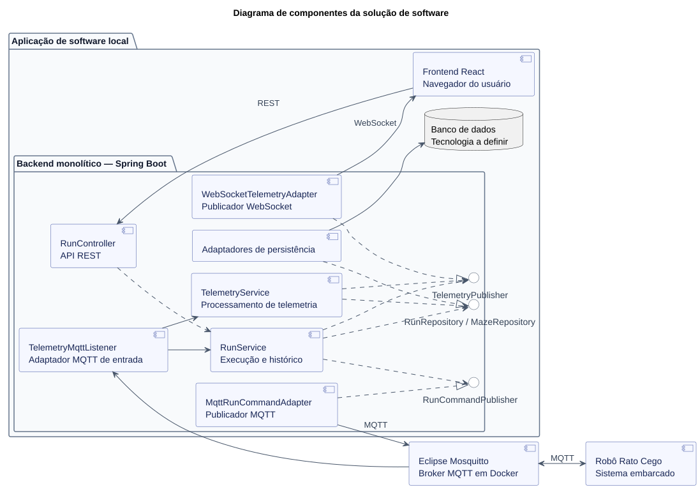
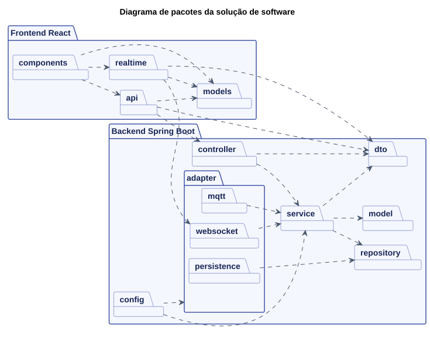
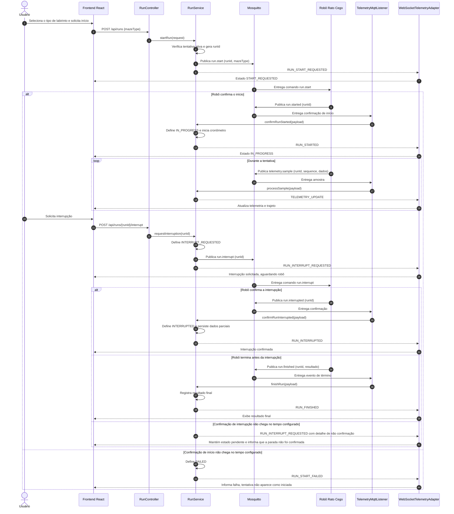
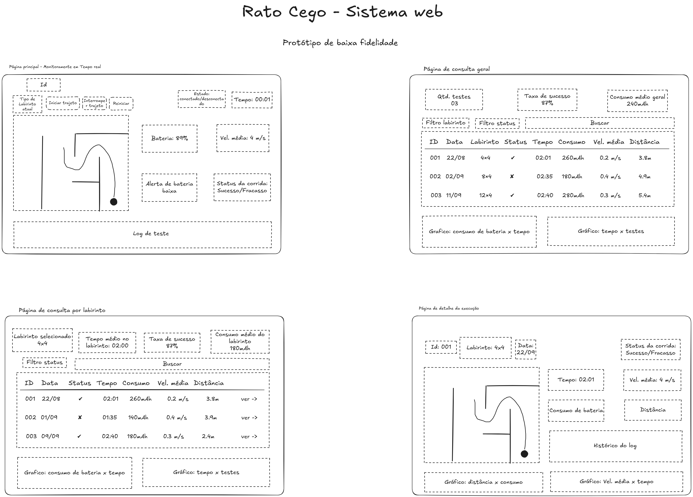
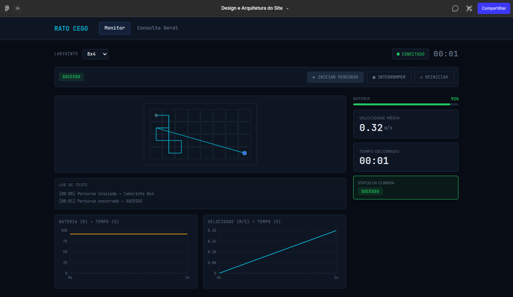
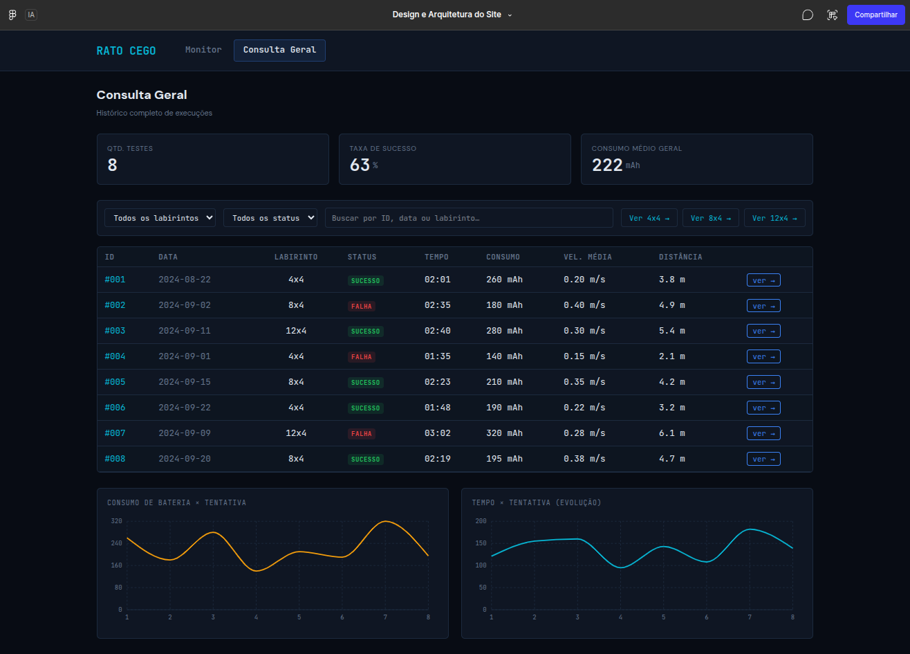
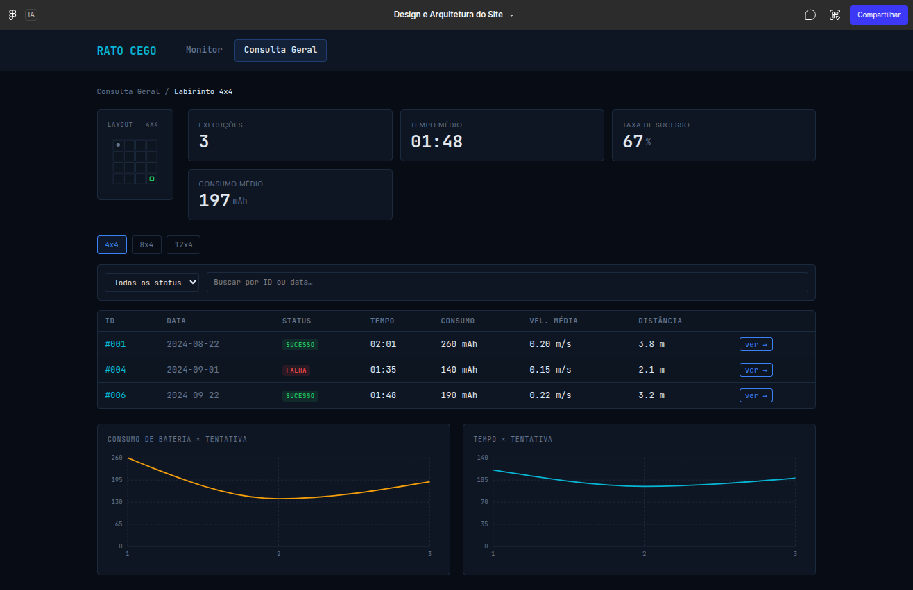
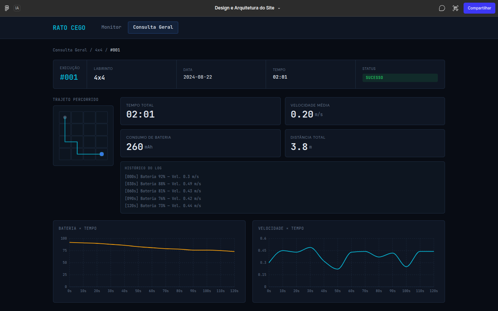

# Projeto Conceitual de Software

- [Explicações adicionais](https://drive.google.com/file/d/1WWIz6609c7Y7zAQRBWHSbX0t2vEJ2z1A/view?usp=sharing)
- [Noções de UML](https://drive.google.com/file/d/1l1yt2ittHuRKIXVXYT76P1HriR07pK-t/view?usp=sharing)
- [Requisitos](https://engsoftmoderna.info/cap3.html)

> **Itens fundamentais:**
> - **Diagrama Atividades UML:** descrever e explicar o fluxo do comportamento funcional do produto proposto, evidenciando, de forma clara e estruturada, como as atividades são executadas, em que ordem e sob quais condições. Esse diagrama permite compreender o funcionamento dinâmico do sistema, destacando:
>   - os principais atores (usuários ou sistemas externos) envolvidos no processo;
>   - as atividades de negócio realizadas por cada ator ou pelo próprio sistema;
>   - os insumos (entradas) necessários para a execução das atividades;
>   - os resultados (saídas) gerados ao longo do fluxo;
>   - os pontos de decisão, paralelismo e sincronização das atividades;
>   - Entre as notações mais relevantes, destacam-se o estado inicial e final, atividades, nós de decisão e junção, barras de bifurcação, Raias (*swimlanes*) e Fluxos de controle.
> - **_Backlog_ do Produto**
>   - Detalhar os requisitos funcionais (RF) com a técnica de documentação e especificação de história de usuário (HU);
>   - Protótipos de interface gráfica do *software* em alta fidelidade.
>     - **Todas HUs devem conter sua descrição (Eu-Como-Para), critérios de aceitação e protótipos de interface, documentadas no github.**
>   - Exporte as informações do Backlog do Produto no GitHub Projects [em formato CSV](https://docs.github.com/en/issues/planning-and-tracking-with-projects/managing-your-project/exporting-your-projects-data), e [renderize em Markdown](https://www.google.com/search?q=convert+CSV+file+to+Markdown+table) no formato a seguir:

### Requisitos Funcionais

<u>RF-00/Épico-00: Título do RF/Épico</u>

| ID (Link Github Projects) | Título | Prioridade |
|:------| :-- | :--- |
| HU-00 | | |
| HU-01 | | |
| HU-02 | | |

<u>RF-01/Épico-01: Título do RF/Épico</u>

| ID (Link Github Projects) | Título | Prioridade |
|:--------------------------| :-- | :--- |
| HU-03                     | | |
| HU-04                     | | |
| HU-05                     | | |

### Requisitos Não-Funcionais

| ID (Link Github Projects) | Título | Prioridade | Rastreabilidade |
|:--------------------------| :-- | :--- |:----------------|
| RNF-01                    | | | RF-00/HU-00     |
| RNF-02                    | | |                 |
| RNF-03                    | | |                 |

> 
> - **Descrição da arquitetura da solução de _software_ proposta:**
>   - Esta subseção deve contemplar o documento de arquitetura do sistema e deve ser estruturado segundo as visões (4+1) previstas no processo unificado (UP): lógica, de processos; implementação, implantação e dados (substituirá a visão de casos de uso).
>   - Propósito do *software* (qual o seu papel no sistema);
>   - Padrão adotado: MVC, MVP, Microsserviços, Monolítico, etc (Justificar);
>   - Linguagens de programação: Java, Python, C#, JavaScript, etc.
>   - *Frameworks* e bibliotecas: Spring Boot, .NET Core, React, Angular, Django, etc.
>   - Banco de dados: Relacional (PostgreSQL, MySQL, etc) X NãoSQL (MongoDB, etc).
>   - Persistência de dados: Modelo Entidade-Relacionamento (MER) e seu respectivo Diagrama Entidade-Relacionamento (DER), aplicáveis quando a solução utiliza banco de dados relacional; alternativamente, diagrama de estrutura de documentos, empregado nos casos em que a arquitetura adota banco de dados não relacional.
> - **Roteiro de testes funcionais:**
>   - Código do caso de teste;
>   - Nome do caso de teste;
>   - Rastreabilidade: Link do(a) RF/HU associado(a);
>   - Objetivo do caso de teste;
>   - Pré-condições do sistema para o teste ser realizado, quando se aplicar;
>   - Descrição dos procedimentos a serem executados para o teste;
>   - Resultado esperado para o teste ser aprovado (pós-condição após realizado o teste);

---

## Arquitetura proposta da solução de software

Esta seção descreve a arquitetura proposta para a aplicação de software do Rato Cego, composta pelo broker MQTT local Eclipse Mosquitto, backend, frontend e banco de dados. A integração com o robô ocorre por meio das mensagens MQTT descritas nesta seção.

Os serviços serão executados localmente, no mesmo computador. Portanto, a solução não depende de plataforma de nuvem, de serviços pagos ou de conexão com a Internet. O Mosquitto será executado em um contêiner Docker e deverá expor a porta MQTT `1883` para a rede local usada pelo robô. A configuração do broker será mantida em arquivo próprio, montado no contêiner, para definir o *listener*, a política de acesso e, quando necessário, a persistência e os registros de operação.

### 1. Propósito do software

O propósito do software é permitir que a equipe selecione o tipo de labirinto, solicite o início e a interrupção de uma tentativa pela interface web, além de receber, tratar, apresentar e conservar as informações de telemetria das execuções do Rato Cego. O backend envia os comandos ao robô pelo broker MQTT; o sistema só confirma o início ou a interrupção depois de receber a confirmação correspondente do sistema embarcado.

Durante a corrida, o backend recebe as informações por intermédio do broker MQTT, atualiza a tela sem que o usuário precise recarregá-la e permite que a equipe acompanhe o desempenho da execução. Os dados apresentados atendem aos indicadores definidos para o projeto: tipo de labirinto, trajeto percorrido, consumo de bateria, velocidade média, tempo de conclusão e confirmação de que o desafio foi cumprido ou não.

Após a corrida, os dados são preservados em banco de dados. Assim, a equipe pode consultar uma execução específica, visualizar todas as execuções associadas a determinado labirinto ou obter uma visão conjunta dos resultados. Essa persistência torna possível comparar tentativas, analisar o comportamento do robô e comprovar as informações solicitadas pelos requisitos.

Em síntese, o software possui quatro responsabilidades principais:

- iniciar e solicitar a interrupção de tentativas a partir da interface web, mantendo o estado sincronizado com as confirmações do robô;
- receber de forma confiável a telemetria produzida pelo micromouse;
- disponibilizar a telemetria ao vivo em uma interface web clara e responsiva;
- registrar as execuções encerradas e disponibilizar seus dados para consulta posterior.

### 2. Arquitetura escolhida

A solução adota uma arquitetura de aplicações monolíticas separadas por responsabilidade. O backend é uma aplicação monolítica desenvolvida em Java com Spring Boot; o frontend é uma aplicação monolítica desenvolvida com React e Tailwind CSS. Elas permanecem no mesmo repositório, mas em diretórios próprios: `src/backend` e `src/frontend`. Essa organização permite desenvolvimento, execução e versionamento independentes, sem introduzir a complexidade operacional de uma arquitetura de microsserviços.

O backend é organizado em camadas. A camada de entrada recebe mensagens MQTT e requisições HTTP; a camada de serviço processa telemetria, controla o ciclo da execução e aplica as regras de negócio; a camada de persistência armazena e consulta os dados no banco; e a camada de saída expõe operações REST, publica comandos MQTT ao robô e envia atualizações ao vivo por WebSocket. A organização interna seguirá o padrão MVC adaptado a uma API: os controladores recebem requisições REST, os serviços coordenam os casos de uso, e os modelos representam os dados do domínio. Os repositórios fazem a comunicação com o banco de dados.

O fluxo de controle e telemetria durante uma tentativa será:

1. O usuário seleciona um tipo de labirinto e solicita o início pelo frontend; este envia uma requisição HTTP à API REST.
2. O backend verifica se não há outra tentativa ativa, gera um `runId`, registra `START_REQUESTED` e publica no Mosquitto o comando MQTT de início com o identificador e o tipo de labirinto.
3. O robô inicia a navegação e publica `run.started` com o mesmo `runId`. Só após receber essa confirmação o backend registra `IN_PROGRESS`, inicia a contagem do tempo e publica a atualização ao frontend por WebSocket.
4. Durante a navegação, o robô publica amostras de telemetria com o mesmo `runId`. O backend processa e persiste as amostras e envia atualizações ao vivo ao frontend.
5. Se o usuário solicitar a interrupção, o backend registra `INTERRUPT_REQUESTED` e publica um comando MQTT de interrupção associado ao `runId` ativo.
6. Quando o robô confirmar a parada com `run.interrupted`, o backend registra `INTERRUPTED`, preserva os dados parciais e atualiza o frontend. Se o robô publicar `run.finished` antes dessa confirmação, o evento de término define o resultado final.
7. Se o início não for confirmado no tempo configurado, a solicitação termina em `FAILED`; se a interrupção não for confirmada, o sistema mantém `INTERRUPT_REQUESTED` e informa que a parada não foi confirmada.

Para acessar dados já armazenados, o frontend envia uma requisição HTTP para a API REST do backend; o controlador direciona a consulta ao serviço correspondente; o serviço recupera as informações no banco de dados definido pelo projeto; e o backend devolve ao frontend uma resposta com os dados solicitados. REST também recebe os comandos de iniciar e interromper; MQTT transporta comandos ao robô e eventos do robô ao backend; WebSocket informa à interface as mudanças de estado e a telemetria ao vivo.

O Mosquitto, o backend Spring Boot, o banco de dados a definir e o frontend React serão processos distintos no mesmo computador. O Mosquitto atua somente como intermediário de mensagens entre o robô e o backend, nos dois sentidos: ele não concentra regras de negócio nem substitui a persistência do banco. O navegador acessa o frontend localmente e mantém a conexão WebSocket com o backend durante o monitoramento.

### 3. Justificativa da arquitetura

A arquitetura foi definida para permitir que a equipe selecione o labirinto e inicie ou solicite a interrupção de uma tentativa, além de receber telemetria, acompanhar a corrida e armazenar os resultados. A aplicação web coordena o ciclo da tentativa, mas não assume a navegação: o robô continua responsável pelo controle físico e pela execução autônoma do percurso. Os comandos e as confirmações passam pelo broker MQTT.

MQTT foi escolhido como ponto de integração com a telemetria porque é um protocolo de mensagens leve e apropriado para comunicação entre dispositivos embarcados e aplicações locais. O Mosquitto foi selecionado como broker por ser leve, aberto, amplamente utilizado e suficiente para o volume de telemetria previsto. Sua imagem oficial para Docker permite iniciar o serviço localmente com configuração, dados e logs separados em volumes. O modelo de publicação e assinatura desacopla o produtor de mensagens do backend: o produtor publica no Mosquitto, e o backend consome somente os tópicos de que necessita. Isso também facilita testes, pois ferramentas de desenvolvimento podem publicar mensagens simuladas no broker sem depender do robô físico.

WebSocket foi escolhido para o caminho entre backend e interface porque a telemetria precisa ser exibida enquanto a corrida ocorre. Com uma conexão persistente, o servidor envia atualizações assim que recebe e processa uma nova mensagem MQTT. Dessa forma, o frontend não precisa consultar repetidamente a API para descobrir se houve alteração. A API REST permanece apropriada para consultas pontuais do histórico, nas quais o usuário escolhe uma lista, uma execução ou um filtro por labirinto.

O backend monolítico em Spring Boot concentra os módulos que pertencem ao mesmo contexto de negócio: recepção da telemetria, acompanhamento de execução, persistência e disponibilização de dados. Para um projeto acadêmico com prazo e equipe limitados, essa escolha reduz a quantidade de aplicações a configurar, implantar, depurar e manter. A separação em camadas preserva a organização do código e permite evolução futura, caso seja necessário extrair algum módulo.

O frontend foi separado do backend porque possui uma responsabilidade própria: oferecer uma interface clara para acompanhar e consultar as corridas. React facilita a composição de telas a partir de componentes reutilizáveis e a atualização de partes da página quando a telemetria muda. Tailwind CSS permite aplicar estilos de forma consistente e construir uma interface responsiva, contribuindo para os requisitos de legibilidade e adaptação a diferentes dimensões de tela.

O uso de serviços locais atende à restrição de recursos do projeto. Executar broker, backend, banco e frontend no mesmo computador elimina custos de hospedagem e reduz dependências externas. A principal condição operacional é que o computador esteja ligado e que o broker esteja acessível na rede local durante as corridas acompanhadas pela aplicação.

### 4. Linguagens de programação

| Tecnologia | Linguagem | Uso na solução |
|---|---|---|
| Backend | Java | Implementação da API REST, integração MQTT, comunicação WebSocket, regras de negócio e acesso ao banco de dados. |
| Frontend | JavaScript | Implementação da interface em React, do consumo da API REST e do recebimento de eventos WebSocket. |
| Estrutura da interface | HTML | Definição da estrutura semântica que será renderizada pelos componentes React. |
| Estilo da interface | CSS | Definição da apresentação visual e das regras responsivas da aplicação, aplicadas com o auxílio do Tailwind CSS. |

Java foi selecionada para o backend por sua maturidade no desenvolvimento de aplicações web e pelo ecossistema do Spring Boot, que reúne recursos para APIs, persistência e comunicação em tempo real em uma única aplicação. JavaScript foi selecionada para o frontend porque é a linguagem executada pelos navegadores e possui integração direta com React, HTTP e WebSocket.

### 5. Frameworks, bibliotecas e serviços de apoio

| Tecnologia | Papel no projeto |
|---|---|
| Spring Boot | Base do backend Java. Centraliza configuração, inicialização da aplicação e integração dos módulos do servidor. |
| Spring Web | Criação da API REST usada pelo frontend para solicitar início/interrupção e consultar execuções e dados históricos. |
| Spring Integration MQTT | Publicação de comandos de início/interrupção e assinatura dos tópicos de confirmação, término e telemetria no broker local. |
| Spring WebSocket | Manutenção das conexões em tempo real e envio de atualizações de telemetria ao frontend. |
| React | Construção da interface web por componentes, telas de acompanhamento e telas de consulta. |
| Tailwind CSS | Estilização da interface por classes utilitárias, com suporte à organização visual e responsividade das telas. |
| Vite | Ferramenta de desenvolvimento e compilação do frontend React, fornecendo servidor local e geração dos arquivos da aplicação. |
| Tecnologia de persistência | Biblioteca ou mecanismo de acesso ao banco será escolhido após a definição do modelo e da tecnologia de banco de dados. |
| Banco de dados a definir | Serviço local destinado ao histórico de execuções e às consultas por labirinto. A escolha entre modelo relacional e não relacional será registrada na visão de dados. |
| Mosquitto em Docker | Broker MQTT local executado em contêiner. Intermedeia comandos publicados pelo backend e eventos de confirmação, término e telemetria publicados pelo robô. A porta `1883` é exposta para a rede local e os arquivos de configuração, dados e logs são mantidos fora do contêiner. |

Spring Boot, React, Tailwind CSS e Mosquitto são tecnologias definidas para o desenvolvimento. O banco de dados e a tecnologia de persistência ainda não foram definidos; essa decisão será documentada antes da elaboração do MER/DER ou da estrutura de documentos correspondente. A configuração do Mosquitto será definida na etapa de infraestrutura, preservando sua função arquitetural de broker local de telemetria.

### 6. Componentes principais e responsabilidades

Os componentes a seguir delimitam as responsabilidades da solução e servem de base para os diagramas de classes, componentes e pacotes.

| Componente | Responsabilidade | Entradas e saídas principais |
|---|---|---|
| Mosquitto em Docker | Intermediar comandos MQTT do backend para o robô e eventos do robô para o backend. É executado em contêiner, com a porta `1883` exposta para a rede local. | Recebe comandos e eventos publicados; entrega-os aos assinantes autorizados. |
| Adaptador MQTT do backend | Receber confirmações, término e telemetria do robô e publicar comandos de início e interrupção no Mosquitto. | Encaminha eventos recebidos ao serviço de execução/telemetria e publica comandos no tópico de controle. |
| RunService (execução e histórico) | Coordenar início, confirmação, interrupção, conclusão e falha; associar tipo de labirinto, telemetria e resultado ao `runId`; consultar execuções persistidas. | Recebe pedidos REST e confirmações MQTT; atualiza o estado, persiste a execução e fornece histórico aos controladores. |
| Serviço de telemetria | Validar e interpretar amostras recebidas, atualizar os indicadores e preparar atualizações para a interface. | Consome amostras MQTT; persiste dados e produz estado atualizado para WebSocket. |
| Controladores REST | Expor consultas do histórico e operações para iniciar e solicitar interrupção de tentativas. | Recebem `POST /api/runs`, `POST /api/runs/{runId}/interrupt` e consultas do navegador; devolvem o estado/resultados. |
| Publicador WebSocket | Enviar ao frontend as atualizações produzidas durante a corrida. | Recebe o estado atualizado da execução; transmite eventos aos navegadores conectados. |
| Modelos e camada de persistência | Representar os dados do domínio e persistir ou consultar as informações no banco. Sua implementação concreta dependerá da tecnologia de banco escolhida. | Converte os dados da aplicação para o formato adotado pelo banco e vice-versa. |
| Banco de dados a definir | Armazenar execuções concluídas e interrompidas, incluindo telemetria parcial e associação ao labirinto correspondente. | Recebe atualizações durante o ciclo de execução; devolve dados para consultas posteriores. |
| Frontend React | Permitir seleção do labirinto, solicitar início/interrupção, exibir o estado confirmado da tentativa, acompanhamento ao vivo e histórico. | Envia comandos de operação e consultas via REST; recebe estados e telemetria via WebSocket. |
| Camada visual Tailwind CSS | Aplicar a apresentação visual e a responsividade das telas React. | Define estilos para os componentes da interface. |

Durante uma execução, o backend publica comandos de início e interrupção solicitados pelo usuário e recebe do robô confirmações, telemetria e o evento de término. O frontend não controla movimentos individuais nem a navegação autônoma; apenas solicita o início ou a interrupção da tentativa. Após a execução, o usuário também pode consultar o histórico pela API REST.

O backend gera um `runId` ao aceitar um pedido de início e inclui esse identificador no comando MQTT. O robô devolve o mesmo `runId` em `run.started`, nas amostras de telemetria e nos eventos finais. Como só pode haver uma tentativa ativa, o backend rejeita outro início enquanto a execução anterior não estiver em estado terminal. Ao encerrar uma execução normal ou interrompida, o backend preserva sua associação ao labirinto e as amostras já recebidas.

### 7. Visão lógica e diagrama de classes UML

A visão lógica organiza os conceitos do domínio e as responsabilidades do backend. A implementação seguirá uma arquitetura em camadas simples: controllers recebem as entradas, services coordenam os casos de uso, models representam o domínio e repositories abstraem a persistência. O padrão Ports and Adapters é aplicado de forma leve: `RunRepository` e `MazeRepository` são portas de persistência; `RunCommandPublisher` e `TelemetryPublisher` são portas de saída declaradas no pacote `service`. Os adaptadores de persistência, MQTT e WebSocket implementam essas portas e fazem a integração com tecnologias externas.

Os nomes de classes, interfaces, enums, atributos e métodos no diagrama estão em inglês, conforme a convenção usual de projetos Java. O restante da documentação permanece em português. As entidades de domínio não possuem herança entre si, pois não há comportamento compartilhado que justifique uma superclasse. As implementações dos adaptadores realizam suas interfaces; essa relação é mostrada com a notação UML de realização.

Figura 1 – Diagrama de classes UML do sistema Rato Cego

```mermaid
classDiagram
    namespace model {
        class Maze {
            +UUID id
            +String name
            +int rows
            +int columns
            +MazeType type
        }
        class Run {
            +UUID id
            +Instant requestedAt
            +Instant startedAt
            +Instant finishedAt
            +RunStatus status
            +Boolean challengeCompleted
            +BigDecimal distanceTravelledMeters
            +BigDecimal averageSpeedMetersPerSecond
            +BigDecimal chargeConsumedMilliampHours
            +BigDecimal energyConsumedWattHours
            +Duration getDuration()
        }
        class TelemetrySample {
            +long sequence
            +Instant recordedAt
            +BigDecimal distanceTravelledMeters
            +BigDecimal currentSpeedMetersPerSecond
            +BigDecimal batteryVoltageVolts
            +BigDecimal currentMilliAmps
            +BigDecimal currentPowerWatts
        }
        class Position {
            +int row
            +int column
            +Heading heading
        }
        class Heading {
            <<enumeration>>
            NORTH
            EAST
            SOUTH
            WEST
        }
        class RunStatus {
            <<enumeration>>
            START_REQUESTED
            IN_PROGRESS
            INTERRUPT_REQUESTED
            COMPLETED
            FAILED
            INTERRUPTED
        }
        class BatteryStatus {
            <<enumeration>>
            NORMAL
            LOW
        }
        class MazeType {
            <<enumeration>>
            GRID_4X4
            GRID_8X4
            GRID_12X4
        }
    }

    namespace dto {
        class StartRunRequest {
            +MazeType mazeType
        }
        class StartRunCommand {
            +int schemaVersion
            +UUID eventId
            +UUID runId
            +MazeType mazeType
            +Instant timestamp
        }
        class InterruptRunCommand {
            +int schemaVersion
            +UUID eventId
            +UUID runId
            +Instant timestamp
        }
        class RunStartedPayload {
            +int schemaVersion
            +UUID eventId
            +UUID runId
            +Instant timestamp
            +int mazeRows
            +int mazeColumns
        }
        class TelemetrySamplePayload {
            +int schemaVersion
            +UUID eventId
            +UUID runId
            +long sequence
            +Instant timestamp
            +Position position
            +BigDecimal distanceTravelledMeters
            +BigDecimal currentSpeedMetersPerSecond
            +BigDecimal batteryVoltageVolts
            +BigDecimal currentMilliAmps
        }
        class RunFinishedPayload {
            +int schemaVersion
            +UUID eventId
            +UUID runId
            +Instant timestamp
            +RunStatus status
            +Boolean challengeCompleted
        }
        class RunInterruptedPayload {
            +int schemaVersion
            +UUID eventId
            +UUID runId
            +Instant timestamp
        }
        class RunResponse {
            +UUID id
            +MazeType mazeType
            +String mazeName
            +RunStatus status
            +Instant requestedAt
            +Instant startedAt
            +Instant finishedAt
            +Duration duration
            +Boolean challengeCompleted
            +BigDecimal distanceTravelledMeters
            +BigDecimal averageSpeedMetersPerSecond
            +BigDecimal chargeConsumedMilliampHours
            +BigDecimal energyConsumedWattHours
        }
        class RunStartedUpdate {
            +int schemaVersion
            +RunUpdateType eventType
            +UUID runId
            +Instant timestamp
            +int mazeRows
            +int mazeColumns
            +RunStatus status
        }
        class TelemetryUpdate {
            +int schemaVersion
            +RunUpdateType eventType
            +UUID runId
            +long sequence
            +Instant timestamp
            +Position position
            +BigDecimal distanceTravelledMeters
            +BigDecimal currentSpeedMetersPerSecond
            +BigDecimal averageSpeedMetersPerSecond
            +BigDecimal batteryVoltageVolts
            +BigDecimal currentMilliAmps
            +BigDecimal currentPowerWatts
            +BatteryStatus batteryStatus
            +BigDecimal chargeConsumedMilliampHours
            +BigDecimal energyConsumedWattHours
            +Duration elapsedTime
        }
        class RunFinishedUpdate {
            +int schemaVersion
            +RunUpdateType eventType
            +UUID runId
            +Instant timestamp
            +RunStatus status
            +Boolean challengeCompleted
            +BigDecimal distanceTravelledMeters
            +BigDecimal averageSpeedMetersPerSecond
            +BigDecimal chargeConsumedMilliampHours
            +BigDecimal energyConsumedWattHours
            +Duration elapsedTime
        }
        class RunUpdateType {
            <<enumeration>>
            RUN_START_REQUESTED
            RUN_STARTED
            RUN_START_FAILED
            TELEMETRY_UPDATE
            RUN_INTERRUPT_REQUESTED
            RUN_INTERRUPTED
            RUN_FINISHED
        }
        class RunStatusUpdate {
            +int schemaVersion
            +RunUpdateType eventType
            +UUID runId
            +Instant timestamp
            +RunStatus status
            +String detail
        }
    }

    namespace service {
        class RunService {
            +startRun(request) RunResponse
            +requestInterruption(runId) RunResponse
            +confirmRunStarted(payload) void
            +confirmRunInterrupted(payload) void
            +finishRun(payload) void
            +failStart(runId) void
            +getAllRuns() List~RunResponse~
            +getRunsByMaze(mazeId) List~RunResponse~
            +getRunById(runId) RunResponse
        }
        class TelemetryService {
            +processSample(payload) void
        }
        class TelemetryMapper {
            +toDomainSample(payload) TelemetrySample
            +toStartedUpdate(run) RunStartedUpdate
            +toRunStatusUpdate(run, eventType) RunStatusUpdate
            +toTelemetryUpdate(run) TelemetryUpdate
            +toFinishedUpdate(run) RunFinishedUpdate
        }
        class RunCommandPublisher {
            <<interface>>
            +publishStart(command) void
            +publishInterruption(command) void
        }
        class TelemetryPublisher {
            <<interface>>
            +publishRunStatus(update) void
            +publishStarted(update) void
            +publishTelemetry(update) void
            +publishFinished(update) void
        }
    }

    namespace controller {
        class RunController {
            +startRun(request) RunResponse
            +interruptRun(runId) RunResponse
            +getAllRuns() List~RunResponse~
            +getRunsByMaze(mazeId) List~RunResponse~
            +getRunById(runId) RunResponse
        }
    }

    namespace repository {
        class RunRepository {
            <<interface>>
            +save(run) Run
            +findById(runId) Optional~Run~
            +findAll() List~Run~
            +findByMazeId(mazeId) List~Run~
        }
        class MazeRepository {
            <<interface>>
            +findById(mazeId) Optional~Maze~
            +findByDimensions(rows, columns) Optional~Maze~
        }
    }

    namespace adapter {
        class TelemetryMqttListener {
            +onRunStarted(payload) void
            +onTelemetrySample(payload) void
            +onRunFinished(payload) void
            +onRunInterrupted(payload) void
        }
        class MqttRunCommandAdapter
        class RunPersistenceAdapter
        class MazePersistenceAdapter
        class WebSocketTelemetryAdapter
    }

    namespace config {
        class ApplicationConfiguration
    }

    Maze "1" <-- "0..*" Run : belongs to
    Run "1" *-- "0..*" TelemetrySample : contains
    TelemetrySample "1" *-- "0..1" Position : records
    Maze --> MazeType : has type
    Run --> RunStatus : has status
    Run ..> MazeType : selected type
    TelemetryUpdate --> BatteryStatus : reports battery state
    Position --> Heading : faces
    RunStartedUpdate --> RunUpdateType : identifies event
    TelemetryUpdate --> RunUpdateType : identifies event
    RunFinishedUpdate --> RunUpdateType : identifies event

    TelemetryMqttListener ..> RunService : forwards lifecycle events
    TelemetryMqttListener ..> TelemetryService : forwards telemetry samples
    RunController ..> RunService : starts and interrupts
    RunController ..> StartRunRequest : receives
    RunService ..> RunCommandPublisher : sends robot commands
    TelemetryService ..> TelemetryMapper : maps and calculates
    TelemetryService ..> RunRepository : stores samples and runs
    TelemetryService ..> MazeRepository : resolves maze
    TelemetryService ..> TelemetryPublisher : requests live update
    RunService ..> TelemetryPublisher : publishes lifecycle updates
    RunService ..> RunRepository : queries runs
    RunService ..> RunRepository : saves lifecycle state
    RunService ..> MazeRepository : validates maze filter

    RunPersistenceAdapter ..|> RunRepository : implements
    MazePersistenceAdapter ..|> MazeRepository : implements
    WebSocketTelemetryAdapter ..|> TelemetryPublisher : implements
    MqttRunCommandAdapter ..|> RunCommandPublisher : implements
    TelemetryMqttListener ..> RunInterruptedPayload : receives
    MqttRunCommandAdapter ..> StartRunCommand : publishes
    MqttRunCommandAdapter ..> InterruptRunCommand : publishes
    TelemetryMqttListener ..> RunStartedPayload : receives
    TelemetryMqttListener ..> TelemetrySamplePayload : receives
    TelemetryMqttListener ..> RunFinishedPayload : receives
    TelemetryMapper ..> TelemetrySamplePayload : reads
    TelemetryMapper ..> TelemetrySample : creates
    TelemetryMapper ..> RunStartedUpdate : creates
    TelemetryMapper ..> TelemetryUpdate : creates
    TelemetryMapper ..> RunFinishedUpdate : creates
    TelemetryMapper ..> RunStatusUpdate : creates
    RunController ..> RunResponse : returns
    TelemetryPublisher ..> RunStartedUpdate : publishes
    TelemetryPublisher ..> TelemetryUpdate : publishes
    TelemetryPublisher ..> RunFinishedUpdate : publishes
    TelemetryPublisher ..> RunStatusUpdate : publishes lifecycle state
```



Fonte: Elaborado pelos autores (2026).

#### Contratos MQTT de comandos e eventos

O backend publica comandos de controle; o robô publica confirmações e dados da execução. O `runId` é gerado pelo backend ao aceitar o início e precisa ser devolvido pelo robô em todas as mensagens daquela tentativa. O campo `eventId` identifica cada mensagem MQTT; timestamps seguem UTC no formato ISO 8601.

Comandos publicados pelo backend:

| Comando | Tópico | Campos do payload |
|---|---|---|
| `run.start` | `ratocego/commands/run/start` | `schemaVersion`, `eventId`, `runId`, `mazeType`, `timestamp` |
| `run.interrupt` | `ratocego/commands/run/interrupt` | `schemaVersion`, `eventId`, `runId`, `timestamp` |

Eventos publicados pelo robô e recebidos pelo backend:

| Evento | Tópico | Campos do payload |
|---|---|---|
| `run.started` | `ratocego/runs/{runId}/started` | `schemaVersion`, `eventId`, `runId`, `timestamp`, `mazeRows`, `mazeColumns` |
| `telemetry.sample` | `ratocego/runs/{runId}/telemetry` | `schemaVersion`, `eventId`, `runId`, `sequence`, `timestamp`, `position` (`row`, `column`, `heading`), `distanceTravelledMeters`, `currentSpeedMetersPerSecond`, `batteryVoltageVolts`, `currentMilliAmps` |
| `run.finished` | `ratocego/runs/{runId}/finished` | `schemaVersion`, `eventId`, `runId`, `timestamp`, `status`, `challengeCompleted` |
| `run.interrupted` | `ratocego/runs/{runId}/interrupted` | `schemaVersion`, `eventId`, `runId`, `timestamp` |

O robô publica `run.started` somente quando tiver aceitado o comando e efetivamente iniciado a tentativa. `run.interrupted` confirma que a navegação foi interrompida; o recebimento do comando pelo broker, por si só, não é confirmação de parada. Se `run.finished` chegar enquanto a interrupção estiver pendente, o evento de término recebido do robô define o resultado final. O backend só processa amostras cujo `runId` corresponda à tentativa atual e que tenham chegado após a confirmação de início; mensagens de outra tentativa ou recebidas após um estado terminal não alteram a execução atual. Uma nova tentativa só pode ser solicitada depois que a anterior estiver em estado terminal. `sequence` começa em 1 e cresce a cada amostra, permitindo detectar duplicatas e lacunas. `row` e `column` usam índices começando em zero; `heading` aceita `NORTH`, `EAST`, `SOUTH` ou `WEST`. `distanceTravelledMeters` contém a distância acumulada desde o início da corrida.

O início é solicitado pelo frontend por `POST /api/runs`, com `mazeType` (`GRID_4X4`, `GRID_8X4` ou `GRID_12X4`). A interrupção é solicitada por `POST /api/runs/{runId}/interrupt`. O primeiro pedido é rejeitado se já houver tentativa ativa; a interrupção só é aceita para a tentativa ativa. O backend publica atualização WebSocket para estados pendentes e confirmados. Os tempos limite de confirmação são configuráveis: ausência de confirmação de início encerra a solicitação em `FAILED`; ausência de confirmação de interrupção mantém `INTERRUPT_REQUESTED` e é apresentada como não confirmada.

Exemplo de comando de início publicado pelo backend:

```json
{
  "schemaVersion": 1,
  "eventId": "6d744c8b-0157-4f1b-8a32-64d5dbf5520d",
  "runId": "31d9fc40-faf4-45b2-9980-b86437de6211",
  "mazeType": "GRID_8X4",
  "timestamp": "2026-09-22T14:30:00.000Z"
}
```

Exemplo de comando de interrupção publicado pelo backend:

```json
{
  "schemaVersion": 1,
  "eventId": "70423732-439f-49aa-b742-04b8c3b85c9e",
  "runId": "31d9fc40-faf4-45b2-9980-b86437de6211",
  "timestamp": "2026-09-22T14:30:05.000Z"
}
```

Exemplo de confirmação de interrupção publicada pelo robô:

```json
{
  "schemaVersion": 1,
  "eventId": "7064f529-2de3-44d7-8b1a-5602756279bd",
  "runId": "31d9fc40-faf4-45b2-9980-b86437de6211",
  "timestamp": "2026-09-22T14:30:05.400Z"
}
```

Exemplo de amostra recebida:

```json
{
  "schemaVersion": 1,
  "eventId": "bcb2d7a0-e8b7-4d60-8914-3c8e17ff28a3",
  "runId": "31d9fc40-faf4-45b2-9980-b86437de6211",
  "sequence": 12,
  "timestamp": "2026-09-22T14:30:05.200Z",
  "position": { "row": 0, "column": 2, "heading": "EAST" },
  "distanceTravelledMeters": 0.42,
  "currentSpeedMetersPerSecond": 0.18,
  "batteryVoltageVolts": 7.4,
  "currentMilliAmps": 340
}
```

#### Atualizações enviadas ao frontend via WebSocket

O backend envia atualizações JSON pelo endpoint `/ws/telemetry`. O campo `eventType` permite ao frontend distinguir solicitações pendentes de estados confirmados. `RunStatusUpdate` informa pedido de início, falha no início, pedido de interrupção e confirmação de interrupção; `RunStartedUpdate` confirma a abertura e as dimensões da corrida; `TelemetryUpdate` fornece o estado ao vivo; `RunFinishedUpdate` entrega o resumo final. `runId` permite ao cliente associar as mensagens à tentativa correspondente. A API REST responde ao pedido de início/interrupção com a tentativa e o estado atual, que pode ainda ser pendente.

| `eventType` | Campos enviados |
|---|---|
| `RUN_START_REQUESTED` | `schemaVersion`, `eventType`, `runId`, `timestamp`, `status` |
| `RUN_STARTED` | `schemaVersion`, `eventType`, `runId`, `timestamp`, `mazeRows`, `mazeColumns`, `status` |
| `RUN_START_FAILED` | `schemaVersion`, `eventType`, `runId`, `timestamp`, `status`, `detail` |
| `TELEMETRY_UPDATE` | `schemaVersion`, `eventType`, `runId`, `sequence`, `timestamp`, `position`, `distanceTravelledMeters`, `currentSpeedMetersPerSecond`, `averageSpeedMetersPerSecond`, `batteryVoltageVolts`, `currentMilliAmps`, `currentPowerWatts`, `batteryStatus`, `chargeConsumedMilliampHours`, `energyConsumedWattHours`, `elapsedTime` |
| `RUN_INTERRUPT_REQUESTED` | `schemaVersion`, `eventType`, `runId`, `timestamp`, `status`, `detail` opcional para informar ausência de confirmação |
| `RUN_INTERRUPTED` | `schemaVersion`, `eventType`, `runId`, `timestamp`, `status` |
| `RUN_FINISHED` | `schemaVersion`, `eventType`, `runId`, `timestamp`, `status`, `challengeCompleted`, `distanceTravelledMeters`, `averageSpeedMetersPerSecond`, `chargeConsumedMilliampHours`, `energyConsumedWattHours`, `elapsedTime` |

Exemplo de atualização ao vivo enviada:

```json
{
  "schemaVersion": 1,
  "eventType": "TELEMETRY_UPDATE",
  "runId": "31d9fc40-faf4-45b2-9980-b86437de6211",
  "sequence": 12,
  "timestamp": "2026-09-22T14:30:05.200Z",
  "position": { "row": 0, "column": 2, "heading": "EAST" },
  "distanceTravelledMeters": 0.42,
  "currentSpeedMetersPerSecond": 0.18,
  "averageSpeedMetersPerSecond": 0.08,
  "batteryVoltageVolts": 7.4,
  "currentMilliAmps": 340,
  "batteryStatus": "NORMAL",
  "currentPowerWatts": 2.516,
  "chargeConsumedMilliampHours": 0.49,
  "energyConsumedWattHours": 0.0036,
  "elapsedTime": "PT5.2S"
}
```

O backend calcula `currentPowerWatts` a partir da tensão e da corrente. Calcula `chargeConsumedMilliampHours` integrando a corrente pelo intervalo entre amostras e `energyConsumedWattHours` integrando tensão × corrente nesse intervalo. A velocidade média é distância acumulada dividida pelo tempo decorrido; no encerramento, o backend salva no resumo de `Run` os valores finais de distância, duração, velocidade média, carga consumida e energia consumida. `elapsedTime` é calculado a partir dos timestamps, não é um campo exigido do firmware. O campo `challengeCompleted` pode ser nulo quando o resultado for desconhecido, por exemplo em uma execução interrompida.

#### Aviso de bateria baixa

A tensão já é recebida em cada `TelemetrySamplePayload`; portanto, não haverá tópico MQTT nem evento de entrada exclusivo para bateria baixa. Em cada amostra, `TelemetryService` compara `batteryVoltageVolts` com dois limites configuráveis: tensão abaixo do limite crítico faz o estado entrar em `LOW`; em `LOW`, o estado só volta a `NORMAL` quando a tensão ultrapassa o limite de recuperação, que é superior ao crítico. Igualdade com qualquer limite mantém o estado anterior. Esse intervalo implementa histerese e evita que o aviso oscile quando a tensão varia perto do limite.

O estado calculado é incluído em cada `TelemetryUpdate` no campo `batteryStatus`. O frontend exibe um aviso persistente enquanto o valor for `LOW` e o remove quando voltar a `NORMAL`. O aviso não gera registro nem histórico próprio no banco; as amostras de tensão continuam sendo persistidas como parte da telemetria da execução. Os valores dos dois limites devem ser definidos pela equipe de energia/hardware conforme a bateria utilizada e configurados no backend; não se deve fixar valores arbitrários no código.

No início de cada execução, o monitor começa em `NORMAL` e classifica a primeira amostra recebida. Se essa amostra estiver abaixo do limite crítico, o primeiro `TelemetryUpdate` já informa `LOW`. A interface oculta a leitura da bateria e qualquer aviso quando não recebe novas amostras pelo período configurável de timeout, contado desde a última amostra recebida. Quando a telemetria volta a chegar, a interface retoma a exibição com o estado calculado a partir das amostras recebidas. O timeout deve ser configurado conforme a frequência de telemetria definida para a integração.

#### Fronteira com o sistema embarcado

Para esta arquitetura, o backend recebe `distanceTravelledMeters` e `position` (`row`, `column`, `heading`) em cada amostra de telemetria. O backend usa a distância recebida e a duração da execução para calcular a velocidade média.

O usuário solicita o início ou a interrupção por `RunController`; `RunService` valida o ciclo, cria o `runId`, registra o estado pendente e solicita a publicação de comando por `RunCommandPublisher`. `MqttRunCommandAdapter` publica o comando no broker. Confirmações MQTT chegam por `TelemetryMqttListener` e são encaminhadas ao serviço de execução/telemetria. As amostras são validadas, associadas ao `runId` e ao labirinto, persistidas pelos repositórios e publicadas por `TelemetryPublisher`; `WebSocketTelemetryAdapter` envia a atualização ao frontend. As consultas históricas seguem de `RunController` para `RunService`, que recupera os dados pelos repositórios e devolve DTOs REST.

`MazeType` é escolhido pelo usuário e enviado no comando de início; dimensões informadas em `run.started` confirmam o labirinto iniciado. `RunStatus` registra solicitações, confirmações e o resultado da execução. Mensagens tardias são associadas pelo `runId` e não podem alterar outra tentativa.

### 8. Visão de implementação e diagrama de componentes UML

O diagrama de componentes (Figura 2) apresenta os módulos previstos e os contratos de comunicação entre eles. O frontend solicita operações pela API REST; o backend publica os comandos pelo broker e recebe do robô confirmações, telemetria e eventos de término. O banco aparece sem tecnologia específica porque essa decisão permanece pendente.

Figura 2 – Diagrama de componentes UML da solução de software



Fonte: Elaborado pelos autores (2026).

Os retângulos representam componentes; os círculos identificam as interfaces `RunCommandPublisher`, `TelemetryPublisher` e `RunRepository`/`MazeRepository`. As setas tracejadas representam dependência ou realização de interface, enquanto as contínuas representam comunicação entre componentes. O frontend solicita apenas início e interrupção de uma tentativa; não envia comandos de movimento nem controla a navegação autônoma. O Mosquitto apenas encaminha mensagens MQTT. As portas de persistência isolam os serviços da tecnologia de banco, que será definida posteriormente.

#### Diagrama de pacotes UML

A Figura 3 apresenta uma organização proposta para os pacotes, com nomes convencionais do ecossistema Spring. Ela ainda não representa a estrutura existente no código: os diretórios de backend e frontend permanecem sem implementação. Os pacotes seguem uma organização em camadas com adaptadores nas bordas: `controller` recebe requisições; `service` concentra os casos de uso e as portas de saída; `model` contém o domínio; `repository` declara as portas de persistência; e `adapter` reúne as integrações concretas. As dependências apontam para as abstrações usadas. O broker, o robô e o banco não aparecem aqui porque são componentes externos, já apresentados na Figura 2.

Figura 3 – Diagrama de pacotes UML da solução de software



As setas tracejadas com ponta aberta representam dependências UML. `api` depende de `controller` para as operações REST; `realtime` depende de `adapter.websocket` para as atualizações WebSocket. As interfaces `RunCommandPublisher` e `TelemetryPublisher` pertencem ao pacote `service`; `RunRepository` e `MazeRepository` pertencem a `repository`. As implementações concretas ficam nos adaptadores. A tecnologia do adaptador de persistência permanece em aberto até a escolha do banco.

#### Sequência de início, acompanhamento e interrupção

A Figura 4 detalha a ordem das mensagens entre o usuário, o frontend, o backend, o broker e o robô. O início só é confirmado após `run.started`; a interrupção só é concluída após `run.interrupted`. O caminho alternativo mostra o caso de o robô concluir a tentativa enquanto a interrupção está pendente.

Figura 4 – Diagrama de sequência do ciclo de uma tentativa



Fonte: Elaborado pelos autores (2026).

### 9. Protótipo de Baixa Fidelidade

Antes do desenvolvimento do protótipo de alta fidelidade, foi elaborado um protótipo de baixa fidelidade com o objetivo de validar a arquitetura de informação e a navegação entre as páginas do sistema, sem se preocupar ainda com aspectos visuais como cores, tipografia e componentes estilizados. Essa etapa permitiu revisar rapidamente quais dados cada página deveria concentrar antes de investir tempo na fidelidade visual. O protótipo de baixa fidelidade contempla as mesmas quatro páginas definidas para o protótipo funcional:

**1. Página de Monitoramento em Tempo Real:** representa, em blocos, as informações a serem exibidas durante a execução de um teste — tipo de labirinto, estado de conexão, cronômetro, indicador de bateria, velocidade média e status final — além de um espaço reservado para a visualização do trajeto sendo percorrido.

**2. Página de Consulta Geral:** delimita os blocos de métricas agregadas, os filtros de busca e a estrutura da tabela de execuções, sem ainda detalhar sua estilização.

**3. Página de Consulta por Labirinto:** reaproveita a estrutura da consulta geral, delimitando o espaço destinado ao filtro por tipo de labirinto e à miniatura do seu layout.

**4. Página de Detalhe da Execução:** delimita os blocos de identificação da execução, visualização do trajeto final e as métricas específicas daquela tentativa.

<p align="center">
  
</p>

<p align="center"><em>Figura 5 – Wireframes das páginas do sistema web.</em></p>

### 10. Protótipo Funcional

O protótipo funcional foi desenvolvido com base nos requisitos funcionais que envolvem apresentação e interação na interface do sistema web. O protótipo possui quatro páginas principais:

**1. Página de Monitoramento em Tempo Real:** utilizada durante a execução de cada teste, exibe o labirinto sendo mapeado conforme o **Rato Cego** o percorre, além do nível de bateria com alerta visual em caso de nível crítico, tempo decorrido e velocidade média calculada em tempo real. A página também apresenta o controle de início do percurso e seus respectivos estados (aguardando, em execução e concluído). As RFs relacionadas incluem: RF1, RF3, RF12, RF26, RF28, RF29, RF30, RF31, RF32, RF33.

**2. Página de Consulta Geral:** concentra as informações de todos os testes já executados, independentemente do labirinto, fornecendo métricas agregadas (quantidade de testes, taxa de sucesso e consumo médio geral), uma tabela para consulta histórica dos trajetos anteriores e filtros por labirinto e por status da execução. As RFs relacionadas incluem: RF34, RF35, RF37, RNF38.

**3. Página de Consulta por Labirinto:** apresenta a mesma estrutura da consulta geral, porém filtrada a um único tipo de labirinto (4×4, 8×4 ou 12×4), permitindo comparar o desempenho do robô entre diferentes tentativas de um mesmo percurso. A RF relacionada é: RF36.

**4. Página de Detalhe da Execução:** exibe os dados completos de uma execução específica, incluindo o trajeto final percorrido e os valores absolutos de consumo de bateria, tempo total e velocidade média daquela tentativa. As RFs relacionadas incluem: RF26, RNF38.

<p align="center">
  
  
</p>

<p align="center">
  
  
</p>

<p align="center"><em>Figura 6 – Páginas de protótipo funcional.</em></p>