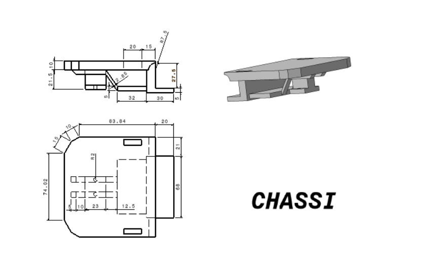
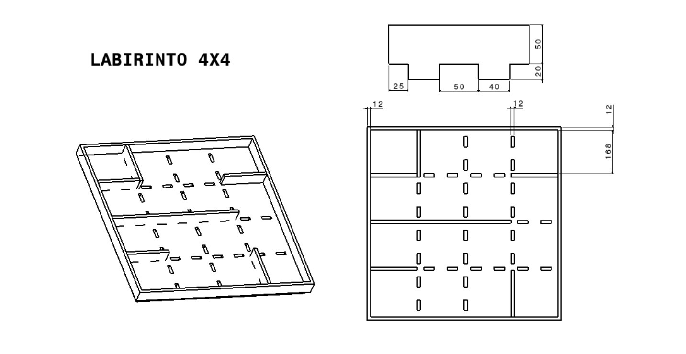
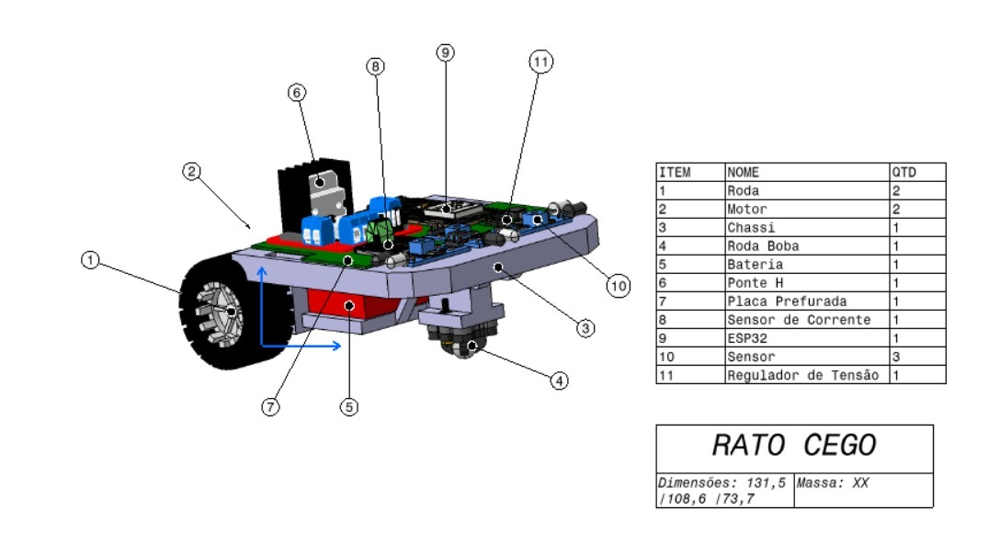

# Projeto conceitual da estrutura do produto

## 1. Projeto mecânico do chassi

O chassi do Rato Cego é uma peça única impressa em 3D que reúne, em um só corpo, a placa de fixação da eletrônica, o suporte dos motores, o compartimento da bateria e o apoio da roda boba. Essa integração elimina suportes e parafusos intermediários, reduz o número de peças e facilita a montagem e a manutenção do robô. O projeto priorizou três aspectos: manter o robô compacto o suficiente para circular com folga nos corredores do labirinto, concentrar a massa próxima ao piso e distribuir os apoios de forma equilibrada.

A placa superior, com 83,84 mm de comprimento, 74,02 mm de largura e 10 mm de espessura, recebe a placa perfurada com o ESP32, a ponte H, o sensor de corrente e o regulador de tensão. Os cantos traseiros são chanfrados, o que reduz o risco de a traseira enroscar nas paredes durante as curvas, e furos na placa permitem a passagem da fiação da bateria, instalada no nível inferior, até a eletrônica.

Na parte dianteira, um prolongamento mais baixo da placa serve de apoio para a roda boba, com transição arredondada para a placa superior. Na parte traseira, sob a placa, uma estrutura com paredes de 5 mm de espessura forma o compartimento da bateria e os apoios laterais dos motores, ligada à placa por um reforço inclinado que aumenta a rigidez do conjunto. As dimensões detalhadas constam na Figura 1.

<figure>

<figcaption>

**Figura 1.** Desenho técnico do chassi com vistas lateral, superior e isométrica.

</figcaption>

</figure>

## 2. Seleção do material do chassi

O chassi será fabricado por impressão 3D em PLA, material escolhido pelo baixo custo, pela ampla disponibilidade e pela facilidade de impressão, que não exige mesa aquecida em temperaturas elevadas e apresenta baixa deformação durante o resfriamento. Como o Rato Cego é um robô leve, que opera em ambiente fechado e a baixas velocidades, os esforços sobre a estrutura são pequenos e a rigidez do PLA é suficiente para sustentar a bateria, os motores e a eletrônica sem apresentar deformação.

A boa precisão dimensional do PLA é especialmente relevante para o chassi, pois os apoios dos motores, o compartimento da bateria e o apoio da roda boba dependem de medidas precisas para que os três pontos de contato com o piso fiquem no mesmo plano. Por outro lado, o material apresenta menor resistência ao calor que o PETG; como os motores e a ponte H do projeto operam com correntes baixas, o aquecimento esperado não compromete a peça. A possibilidade de reimpressão rápida e de baixo custo também facilita ajustes de projeto entre as versões do protótipo.

## 3. Posicionamento dos componentes

A estabilidade do Rato Cego foi definida por duas decisões de projeto: a posição da roda boba em relação às rodas motrizes e a posição da bateria, componente mais pesado do conjunto. A Tabela 1 apresenta a distribuição dos componentes pelo chassi resultante dessas decisões.

**Tabela 1.** Distribuição dos componentes no chassi.

| Componente | Quantidade | Posição no chassi | Função |
|---|:---:|---|---|
| Bateria | 1 | Traseira, nível inferior | Alimentação do sistema |
| Motor DC | 2 | Traseira, nível inferior, um de cada lado | Acionamento das rodas motrizes |
| Roda | 2 | Traseira, laterais | Tração e apoio |
| Roda boba | 1 | Dianteira, nível inferior | Terceiro ponto de apoio |
| Sensor de distância | 3 | Dianteira, nível superior | Detecção das paredes frontal e laterais |
| ESP32 | 1 | Nível superior, sobre a placa perfurada | Processamento e navegação |
| Ponte H | 1 | Nível superior, sobre a placa perfurada | Controle dos motores |
| Sensor de corrente | 1 | Nível superior, sobre a placa perfurada | Monitoramento do consumo |
| Regulador de tensão | 1 | Nível superior, sobre a placa perfurada | Alimentação da eletrônica |

A roda boba foi posicionada de modo que seus pontos de contato com o piso e os das duas rodas motrizes formem um triângulo equilátero. Com os três apoios igualmente afastados entre si, o peso do robô é distribuído de forma equilibrada e a margem de estabilidade contra tombamento é a mesma em todas as direções, o que evita que o robô incline para frente nas frenagens ou para o lado nas curvas. Essa configuração também mantém a roda boba próxima das rodas motrizes, sem alongar o robô além do necessário para circular no labirinto.

A bateria, por ser o componente mais pesado, foi colocada na parte traseira e inferior do chassi, junto aos motores. Essa posição abaixa o centro de massa do robô e o mantém dentro do triângulo de apoio, além de concentrar carga sobre as rodas motrizes, o que melhora a tração e reduz o escorregamento nas curvas. Do ponto de vista de espaço, a região sob a placa, que de outra forma não seria aproveitada, passa a receber a bateria, enquanto a parte superior fica livre para a eletrônica e os sensores.

## 4. Labirinto de teste

Para validar o Rato Cego em condições próximas às do ambiente de avaliação, foi projetado um labirinto de testes de 4x4 células, arranjo que simplifica a fabricação e reduz o custo em relação a labirintos maiores. Cada célula tem passo de 180 mm, com espaço livre interno de 168 mm entre paredes de 12 mm de espessura, o que resulta em uma área total de aproximadamente 732 mm x 732 mm. Com 108,6 mm de largura, o robô circula nos corredores com cerca de 30 mm de folga de cada lado.

O labirinto é modular: a base possui rasgos de encaixe distribuídos ao longo das linhas da grade, e as paredes são peças independentes que se encaixam nesses rasgos, de modo que o mesmo conjunto pode ser remontado em diferentes configurações de percurso. Cada parede tem 50 mm de altura útil acima da base e abas de encaixe de 20 mm na parte inferior, que fixam a peça na posição e impedem seu deslocamento durante os testes. A base e as paredes serão cortadas em MDF, material de baixo custo, fácil corte e boa estabilidade dimensional. O desenho do labirinto é apresentado na Figura 2.

<figure>

<figcaption>

**Figura 2.** Labirinto 4x4 em perspectiva, vista superior e detalhe do perfil da parede.

</figcaption>

</figure>

## 5. Rodas e roda boba

O sistema de tração é diferencial: dois motores DC fixados simetricamente na traseira do chassi acionam, cada um, uma roda por acoplamento direto ao eixo, sem engrenagens ou correias intermediárias. O robô avança com os dois motores no mesmo sentido e gira acionando-os em velocidades ou sentidos diferentes, o que elimina a necessidade de um mecanismo de direção e permite girar sobre o próprio eixo dentro de uma célula. As rodas serão modeladas e impressas em 3D, com o aro adaptado ao eixo do motor escolhido, e receberão pneu de borracha para garantir aderência ao piso do labirinto e evitar escorregamento nas acelerações e curvas.

A roda boba é uma esfera livre montada no prolongamento dianteiro do chassi. Por girar em qualquer direção com baixo atrito, ela não oferece resistência às curvas nem provoca desvios de trajetória, ao contrário de uma roda giratória de eixo vertical, que se alinha ao movimento com atraso. Sua posição foi definida de forma que os três pontos de contato com o piso formem o triângulo equilátero descrito na [Seção 3](#3-posicionamento-dos-componentes), e a altura do apoio no chassi foi ajustada para que a placa superior permaneça paralela ao piso, mantendo os sensores dianteiros na altura correta em relação às paredes de 50 mm.

## 6. Montagem (*assembly*)

A disposição final do Rato Cego é ilustrada na Figura 3, com a numeração dos componentes conforme a lista de peças. O conjunto montado tem dimensões de 131,5 mm de comprimento, 108,6 mm de largura e 73,7 mm de altura. O robô é organizado em dois níveis: no inferior ficam os motores, a bateria e a roda boba, que definem o apoio e concentram a massa junto ao piso; no superior fica toda a eletrônica sobre a placa perfurada, com acesso livre para ligações e ajustes, e os três sensores de distância na dianteira, voltados para a frente e para as laterais. O robô não possui carenagem, pois opera em ambiente fechado e controlado, e a eletrônica exposta facilita a manutenção e reduz massa e custo.

<figure>

<figcaption>

**Figura 3.** *Assembly* do projeto Rato Cego, com lista de peças e dimensões gerais.

</figcaption>

</figure>
