# Projeto Conceitual de Software

## Arquitetura da solução de software

Esta seção descreve a arquitetura da aplicação de software do Rato Cego, composta pelo broker MQTT local Eclipse Mosquitto, backend, frontend e banco de dados. O backend Spring Boot recebe eventos MQTT e telemetria, persiste os dados e transmite atualizações STOMP/WebSocket; os fluxos REST de início, interrupção e consulta histórica integram a mesma arquitetura.

Os serviços serão executados localmente, no mesmo computador. Portanto, a solução não depende de plataforma de nuvem, de serviços pagos ou de conexão com a Internet. O Mosquitto será executado em um contêiner Docker e deverá expor a porta MQTT `1883` para a rede local usada pelo robô. A configuração do broker será mantida em arquivo próprio, montado no contêiner, para definir o *listener*, a política de acesso e, quando necessário, a persistência e os registros de operação.

### 1. Visão de implementação e diagrama de componentes UML

O diagrama de componentes (Figura 1) apresenta os módulos e contratos de comunicação entre eles. O frontend solicita operações pela API REST; o backend publica comandos pelo broker e recebe do robô confirmações, telemetria e eventos de término. O PostgreSQL é o banco relacional local.

Figura 1 – Diagrama de componentes UML da solução de software

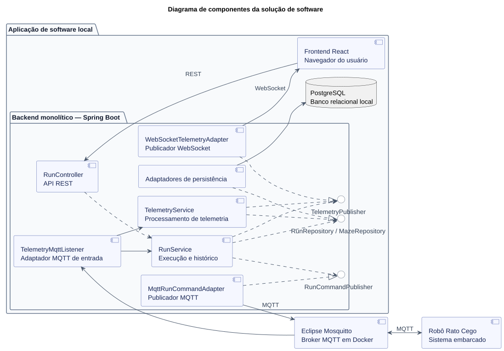

Fonte: Elaborado pelos autores (2026).

Os retângulos representam componentes; os círculos identificam as portas `MessagePublisher` e `TelemetryPublisher`, além dos repositórios Spring Data JPA. As setas tracejadas representam dependência ou realização de interface, enquanto as contínuas representam comunicação entre componentes. O frontend solicita início e interrupção; não envia comandos de movimento nem controla a navegação autônoma. O Mosquitto encaminha mensagens MQTT. Os serviços usam `RunRepository` e `TelemetrySampleRepository` para persistir execuções e amostras e publicam `WebSocketUpdateEvent`. O `WebSocketUpdateEventListener` recebe o evento após o commit e encaminha a atualização pelo `TelemetryPublisher` ao adaptador STOMP.

#### 2. Diagrama de pacotes UML

A Figura 2 apresenta a organização dos pacotes. No backend, `controller` recebe requisições; `service` concentra o ciclo de vida e o processamento da telemetria; `service.port` declara as portas de publicação; `model` contém as entidades e enums; `repository` contém repositórios Spring Data JPA; `mapper` converte dados de telemetria; `util` interpreta payloads MQTT; e `adapter` reúne as integrações MQTT e WebSocket. No frontend, `components`, `api`, `realtime` e `models` organizam a interface e suas comunicações. O broker, o robô e o banco são componentes externos apresentados na Figura 1.

Figura 2 – Diagrama de pacotes UML da solução de software

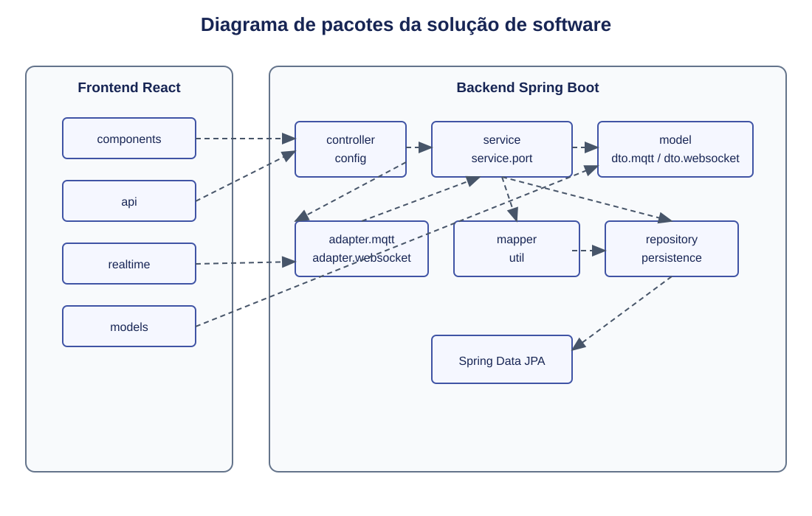

As setas tracejadas com ponta aberta representam dependências UML. `api` depende de `controller` para operações REST; `realtime` recebe atualizações do adaptador WebSocket. `MessagePublisher` e `TelemetryPublisher` pertencem a `service.port`; `RunRepository` e `TelemetrySampleRepository` pertencem a `repository` e estendem Spring Data JPA.

### 3. Visão e diagrama de implantação
Todos os serviços de software residem no mesmo computador local . O robô é o único nó separado e alcança o Mosquitto pela rede local. O navegador pode rodar nesse computador; para outro dispositivo acessar uma interface, seria necessário configurar a exposição das portas HTTP e WebSocket na rede.

<p align="center"><em>Figura 3 – Diagrama de implantação da solução.</em></p>


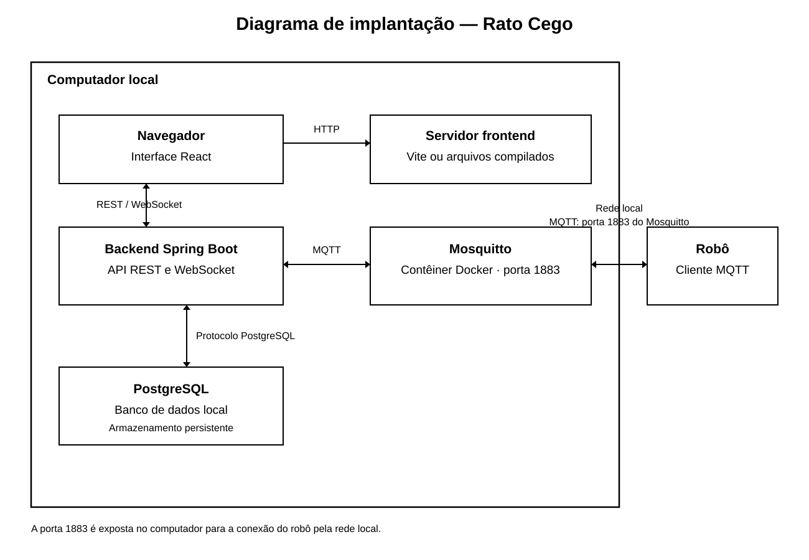

O contêiner do Mosquitto monta o arquivo de configuração e, se habilitados, diretórios persistentes de dados e logs. O PostgreSQL utiliza armazenamento persistente para que reinícios de processos não apaguem o histórico. O backend inicia com a conexão ao banco e às configurações da corretora; o frontend recebe o endereço local da API e do WebSocket. A porta 1883 precisa ser acessível ao robô na rede local; As demais portas podem ser restritas ao computador quando a interface é usada apenas nele. A solução opera sem Internet, desde que computador, robô e rede local estão disponíveis.


### 4. Comunicação entre componentes

| Origem → destino | Protocolo | Dados ou operação |
|---|---|---|
| Navegador → frontend local | HTTP | Carregamento da aplicação React. |
| Frontend → backend | HTTP/REST | Início, solicitação de interrupção e consultas históricas. |
| Frontend ↔ backend | WebSocket | Conexão para receber estados e telemetria ao vivo. |
| Backend → Mosquitto → robô | MQTT | Comandos `run.start` e `run.interrupt`. |
| Robô → Mosquitto → backend | MQTT | `run.started`, `telemetry.sample`, `run.finished` e `run.interrupted`. |
| Backend ↔ PostgreSQL | Protocolo PostgreSQL | Gravação e consulta de tentativas e amostras. |

### 5. Diagrama de atividades UML

O diagrama de atividades (Figura 4) descreve o comportamento funcional do sistema durante uma tentativa, da seleção do labirinto à consulta do histórico. Ele é organizado em quatro raias: **Usuário** (equipe que opera o sistema), **Frontend** (interface web), **Backend** (aplicação Spring Boot) e **Robô** (firmware do Rato Cego). A comunicação entre Backend e Robô passa pelo broker Mosquitto (MQTT), que apenas encaminha mensagens e, por isso, não é representado como raia.

Figura 4 – Diagrama de atividades UML do ciclo de uma tentativa

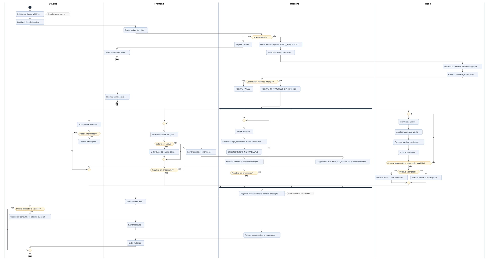


Fonte: Elaborado pelos autores (2026).

**Início da tentativa.** O usuário seleciona o tipo de labirinto e solicita o início. O backend verifica se já existe uma tentativa ativa: em caso positivo, o pedido é rejeitado; caso contrário, gera o `runId`, registra `START_REQUESTED` e publica o comando de início. O robô inicia a navegação e publica a confirmação. Se `run.started` não chegar em até **5 segundos** após o envio do comando, a tentativa é registrada como `FAILED`; se chegar, passa a `IN_PROGRESS` e a contagem do tempo começa.

**Execução em paralelo.** A partir desse ponto, uma barra de bifurcação divide o fluxo em quatro atividades simultâneas:
- o robô repete o ciclo de identificar paredes, atualizar posição e trajeto, executar o próximo movimento e publicar telemetria;
- o backend valida cada amostra, calcula tempo, velocidade média e consumo, classifica o estado da bateria, persiste os dados e envia a atualização;
- o frontend exibe os seis dados obrigatórios e o trajeto, além do aviso de bateria baixa quando o estado for `LOW`;
- o usuário acompanha a corrida e pode solicitar a interrupção.

**Encerramento.** O ciclo do robô termina quando ele alcança o objetivo, publicando o término com o resultado do desafio, ou quando recebe a interrupção, publicando a confirmação de parada. A barra de junção sincroniza os fluxos; o backend registra o resultado final e persiste a execução associada ao labirinto, e o frontend exibe o resumo. Por fim, o usuário pode consultar o histórico por labirinto específico ou de forma geral.

**Entradas e saídas.** As entradas do fluxo são o tipo de labirinto escolhido, as amostras de telemetria do robô e o filtro de consulta. As saídas são os comandos enviados ao robô, os seis dados exibidos em tempo real, a execução armazenada e o histórico consultado. Os tempos limite de confirmação e os casos alternativos de interrupção estão detalhados no diagrama de sequência (Figura 5).


#### 6. Diagrama de sequência do ciclo de execução

A Figura 5 detalha a ordem das mensagens entre o usuário, o frontend, o backend, o broker e o robô. O início só é confirmado após `run.started`; a interrupção só é concluída após `run.interrupted`. O caminho alternativo mostra o caso de o robô concluir a tentativa enquanto a interrupção está pendente.

Figura 5 – Diagrama de sequência do ciclo de uma tentativa

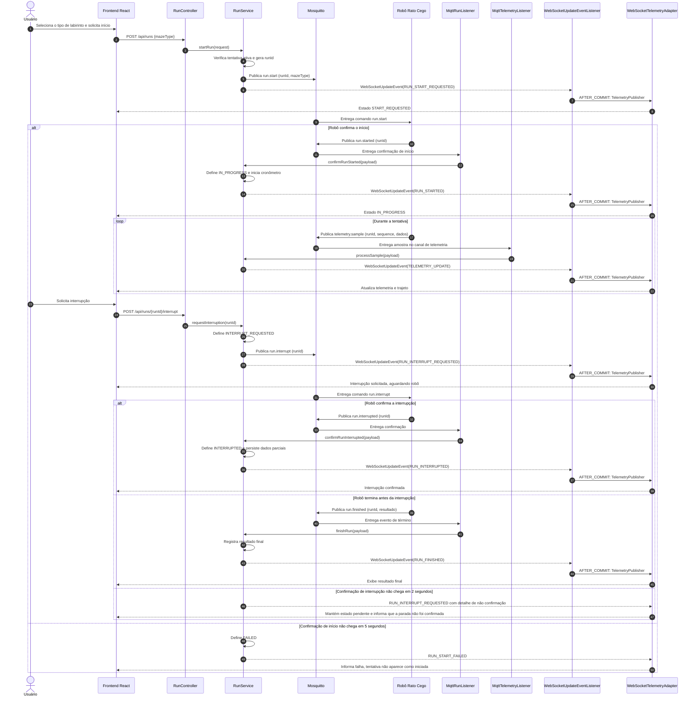

Fonte: Elaborado pelos autores (2026).

### 7. Visão lógica e diagrama de classes UML

A visão lógica organiza os conceitos do domínio e as responsabilidades do backend. Controllers recebem entradas REST; `RunLifecycleService` processa os eventos do ciclo de execução; `TelemetryService` valida e processa amostras; models representam o domínio; e repositórios Spring Data JPA persistem dados. Os serviços publicam `WebSocketUpdateEvent`, que contém um `WebSocketUpdate` type-safe. O `WebSocketUpdateEventListener`, anotado com `@TransactionalEventListener(phase = AFTER_COMMIT)`, encaminha o update ao `TelemetryPublisher` somente após o commit. `MessagePublisher` e `TelemetryPublisher`, em `service.port`, isolam as publicações MQTT e WebSocket. `MqttPayloadParser` interpreta os payloads, e `TelemetryMapper` prepara os dados de telemetria.

Os nomes de classes, interfaces, enums, atributos e métodos no diagrama estão em inglês, conforme a convenção usual de projetos Java. O restante da documentação permanece em português. As entidades de domínio não possuem herança entre si, pois não há comportamento compartilhado que justifique uma superclasse. As implementações dos adaptadores realizam suas interfaces; essa relação é mostrada com a notação UML de realização.

`RunStatus` controla as transições do ciclo por `transitionTo(next)`, implementado com `switch` no próprio enum. São válidas `START_REQUESTED → IN_PROGRESS` e `START_REQUESTED → FAILED`; `IN_PROGRESS → INTERRUPT_REQUESTED`, `COMPLETED` ou `FAILED`; e `INTERRUPT_REQUESTED → INTERRUPTED`, `COMPLETED` ou `FAILED`. `COMPLETED`, `FAILED` e `INTERRUPTED` são estados terminais e não aceitam novas transições.

Figura 6 – Diagrama de classes UML do sistema Rato Cego

```mermaid
classDiagram
    namespace model {
        class Run {
            +Long id
            +RunStatus status
            +Instant startedAt
            +Instant finishedAt
            +Integer mazeRows
            +Integer mazeColumns
            +Boolean challengeCompleted
            +BigDecimal distanceTravelledMeters
            +BigDecimal averageSpeedMetersPerSecond
            +BigDecimal chargeConsumedMilliampHours
            +BigDecimal energyConsumedWattHours
            +BatteryStatus batteryStatus
            +long lastSequence
            +Instant lastSampleAt
            +BigDecimal lastCurrentMilliAmps
            +BigDecimal lastPowerWatts
        }
        class TelemetrySample {
            +Long id
            +long eventId
            +long sequence
            +Instant timestamp
            +int row
            +int column
            +Heading heading
            +BigDecimal distanceTravelledMeters
            +BigDecimal currentSpeedMetersPerSecond
            +BigDecimal batteryVoltageVolts
            +BigDecimal currentMilliAmps
            +BigDecimal currentPowerWatts
        }
        class Position {
            +int row
            +int column
            +Heading heading
        }
        class Heading {
            <<enumeration>>
            NORTH
            EAST
            SOUTH
            WEST
        }
        class RunStatus {
            <<enumeration>>
            START_REQUESTED
            IN_PROGRESS
            INTERRUPT_REQUESTED
            COMPLETED
            FAILED
            INTERRUPTED
            +transitionTo(next) RunStatus
        }
        class BatteryStatus {
            <<enumeration>>
            NORMAL
            LOW
        }
        class MazeType {
            <<enumeration>>
            GRID_4X4
            GRID_8X4
            GRID_12X4
        }
    }
    namespace dto {
        class StartRunRequest {
            +MazeType mazeType
        }
        class StartRunCommand {
            +long eventId
            +long runId
            +MazeType mazeType
            +Instant timestamp
        }
        class InterruptRunCommand {
            +long eventId
            +long runId
            +Instant timestamp
        }
        class RunStartedPayload {
            +long eventId
            +long runId
            +Instant timestamp
            +int mazeRows
            +int mazeColumns
        }
        class TelemetrySamplePayload {
            +long eventId
            +long runId
            +long sequence
            +Instant timestamp
            +Position position
            +BigDecimal distanceTravelledMeters
            +BigDecimal currentSpeedMetersPerSecond
            +BigDecimal batteryVoltageVolts
            +BigDecimal currentMilliAmps
        }
        class RunFinishedPayload {
            +long eventId
            +long runId
            +Instant timestamp
            +RunStatus status
            +Boolean challengeCompleted
        }
        class RunInterruptedPayload {
            +long eventId
            +long runId
            +Instant timestamp
        }
        class WebSocketUpdate {
            <<sealed interface>>
        }
        class RunStartedUpdate {
            +long runId
            +Instant timestamp
            +int mazeRows
            +int mazeColumns
            +RunStatus status
        }
        class TelemetryUpdate {
            +long runId
            +long sequence
            +Instant timestamp
            +Position position
            +BigDecimal distanceTravelledMeters
            +BigDecimal currentSpeedMetersPerSecond
            +BigDecimal averageSpeedMetersPerSecond
            +BigDecimal batteryVoltageVolts
            +BigDecimal currentMilliAmps
            +BigDecimal currentPowerWatts
            +BatteryStatus batteryStatus
            +BigDecimal chargeConsumedMilliampHours
            +BigDecimal energyConsumedWattHours
        }
        class RunFinishedUpdate {
            +long runId
            +Instant timestamp
            +RunStatus status
            +Boolean challengeCompleted
            +BigDecimal distanceTravelledMeters
            +BigDecimal averageSpeedMetersPerSecond
            +BigDecimal chargeConsumedMilliampHours
            +BigDecimal energyConsumedWattHours
        }
        class RunInterruptedUpdate {
            +long runId
            +Instant timestamp
            +RunStatus status
        }
        class RunResponse {
            +long id
            +RunStatus status
            +Instant startedAt
            +Instant finishedAt
            +Duration duration
            +Boolean challengeCompleted
            +BigDecimal distanceTravelledMeters
            +BigDecimal averageSpeedMetersPerSecond
            +BigDecimal chargeConsumedMilliampHours
            +BigDecimal energyConsumedWattHours
        }
    }
    namespace service {
        class RunLifecycleService {
            +processStarted(payload) void
            +processFinished(payload) void
            +processInterrupted(payload) void
        }
        class TelemetryService {
            +processSample(payload) void
        }
        class WebSocketUpdateEvent {
            +WebSocketUpdate update
        }
        class MessagePublisher {
            <<interface>>
            +publish(topic, payload) void
        }
        class TelemetryPublisher {
            <<interface>>
            +publishRunStarted(update) void
            +publishTelemetry(update) void
            +publishRunFinished(update) void
            +publishRunInterrupted(update) void
        }
    }
    namespace mapper {
        class TelemetryMapper {
            +toTelemetryUpdate(payload) TelemetryUpdate
        }
    }
    namespace util {
        class MqttPayloadParser {
            +parseAndValidate(payload, type) T
        }
    }
    namespace controller {
        class RunController {
            +startRun(request) RunResponse
            +interruptRun(runId) RunResponse
            +getAllRuns() List~RunResponse~
            +getRunById(runId) RunResponse
        }
    }
    namespace repository {
        class RunRepository {
            <<JpaRepository~Run, Long~>>
        }
        class TelemetrySampleRepository {
            <<JpaRepository~TelemetrySample, Long~>>
            +existsByEventId(eventId) boolean
            +existsByRun_IdAndSequence(runId, sequence) boolean
        }
    }
    namespace adapter {
        class MqttRunListener {
            +onRunStarted(payload) void
            +onRunFinished(payload) void
            +onRunInterrupted(payload) void
        }
        class MqttTelemetryListener {
            +onTelemetrySample(payload) void
        }
        class MqttMessagePublisherAdapter
        class WebSocketTelemetryAdapter
        class WebSocketUpdateEventListener {
            +onUpdate(event) void
        }
    }
    Run "1" <-- "0..*" TelemetrySample : owns
    TelemetrySamplePayload --> Position : carries
    TelemetryUpdate --> Position : reports
    Run --> RunStatus : has status
    TelemetryUpdate --> BatteryStatus : reports
    RunStartedUpdate ..|> WebSocketUpdate
    TelemetryUpdate ..|> WebSocketUpdate
    RunFinishedUpdate ..|> WebSocketUpdate
    RunInterruptedUpdate ..|> WebSocketUpdate
    WebSocketUpdateEvent --> WebSocketUpdate : contains
    MqttRunListener ..> RunLifecycleService : forwards lifecycle messages
    MqttTelemetryListener ..> TelemetryService : forwards samples
    RunLifecycleService ..> RunRepository : persists state
    RunLifecycleService ..> MessagePublisher : publishes MQTT commands
    TelemetryService ..> RunRepository : updates run metrics
    TelemetryService ..> TelemetrySampleRepository : persists samples
    TelemetryService ..> TelemetryMapper : maps update
    TelemetryService ..> MqttPayloadParser : parses payload
    RunLifecycleService ..> MqttPayloadParser : parses payload
    RunLifecycleService ..> WebSocketUpdateEvent : publishes update
    TelemetryService ..> WebSocketUpdateEvent : publishes update
    WebSocketUpdateEventListener ..> WebSocketUpdateEvent : AFTER_COMMIT
    WebSocketUpdateEventListener ..> TelemetryPublisher : forwards committed update
    WebSocketTelemetryAdapter ..|> TelemetryPublisher : implements
    MqttMessagePublisherAdapter ..|> MessagePublisher : implements
```

Fonte: Elaborado pelos autores (2026).

#### Contratos MQTT de comandos e eventos

O backend publica comandos de controle; o robô publica confirmações e dados da execução. `runId` é um inteiro sequencial gerado pelo backend ao aceitar o início (1, 2, 3...) e precisa ser devolvido pelo robô em todas as mensagens daquela tentativa. `eventId` também é inteiro sequencial, incrementado pelo emissor a cada mensagem MQTT. Ambos são enviados como números JSON, sem aspas. `sequence` continua sendo a contagem específica das amostras de telemetria. Timestamps seguem UTC no formato ISO 8601.

Comandos publicados pelo backend:

| Comando | Tópico | Campos do payload |
|---|---|---|
| `run.start` | `ratocego/commands/run/start` | `eventId`, `runId`, `mazeType`, `timestamp` |
| `run.interrupt` | `ratocego/commands/run/interrupt` | `eventId`, `runId`, `timestamp` |

Eventos publicados pelo robô e recebidos pelo backend:

| Evento | Tópico | Campos do payload |
|---|---|---|
| `run.started` | `ratocego/runs/{runId}/started` | `eventId`, `runId`, `timestamp`, `mazeRows`, `mazeColumns` |
| `telemetry.sample` | `ratocego/runs/{runId}/telemetry` | `eventId`, `runId`, `sequence`, `timestamp`, `position` (`row`, `column`, `heading`), `distanceTravelledMeters`, `currentSpeedMetersPerSecond`, `batteryVoltageVolts`, `currentMilliAmps` |
| `run.finished` | `ratocego/runs/{runId}/finished` | `eventId`, `runId`, `timestamp`, `status`, `challengeCompleted` |
| `run.interrupted` | `ratocego/runs/{runId}/interrupted` | `eventId`, `runId`, `timestamp` |

O robô publica `run.started` somente quando tiver aceitado o comando e efetivamente iniciado a tentativa. `run.interrupted` confirma que a navegação foi interrompida; o recebimento do comando pelo broker, por si só, não é confirmação de parada. Se `run.finished` chegar enquanto a interrupção estiver pendente, o evento de término recebido do robô define o resultado final. O backend só processa amostras cujo `runId` corresponda à tentativa atual e que tenham chegado após a confirmação de início; mensagens de outra tentativa ou recebidas após um estado terminal não alteram a execução atual. Uma nova tentativa só pode ser solicitada depois que a anterior estiver em estado terminal. `sequence` começa em 1 e cresce a cada amostra, permitindo detectar duplicatas e lacunas. `row` e `column` usam índices começando em zero; `heading` aceita `NORTH`, `EAST`, `SOUTH` ou `WEST`. `distanceTravelledMeters` contém a distância acumulada desde o início da corrida.

O início é solicitado pelo frontend por `POST /api/runs`, com `mazeType` (`GRID_4X4`, `GRID_8X4` ou `GRID_12X4`). A interrupção é solicitada por `POST /api/runs/{runId}/interrupt`. O primeiro pedido é rejeitado se já houver tentativa ativa; a interrupção só é aceita para a tentativa ativa. O backend publica atualização WebSocket para estados pendentes e confirmados. `run.started` deve ser recebido em até **5 segundos** após o envio do comando; sem confirmação, a solicitação termina em `FAILED`. `run.interrupted` deve ser recebido em até **2 segundos** após o envio do comando; sem confirmação, o sistema mantém `INTERRUPT_REQUESTED` e informa que a parada não foi confirmada.

Exemplo de comando de início publicado pelo backend:

```json
{
  "eventId": 1,
  "runId": 1,
  "mazeType": "GRID_8X4",
  "timestamp": "2026-09-22T14:30:00.000Z"
}
```

Exemplo de comando de interrupção publicado pelo backend:

```json
{
  "eventId": 2,
  "runId": 1,
  "timestamp": "2026-09-22T14:30:05.000Z"
}
```

Exemplo de confirmação de interrupção publicada pelo robô:

```json
{
  "eventId": 3,
  "runId": 1,
  "timestamp": "2026-09-22T14:30:05.400Z"
}
```

Exemplo de amostra recebida:

```json
{
  "eventId": 4,
  "runId": 1,
  "sequence": 12,
  "timestamp": "2026-09-22T14:30:05.200Z",
  "position": { "row": 0, "column": 2, "heading": "EAST" },
  "distanceTravelledMeters": 0.42,
  "currentSpeedMetersPerSecond": 0.18,
  "batteryVoltageVolts": 7.4,
  "currentMilliAmps": 340
}
```

#### Atualizações enviadas ao frontend via WebSocket

O backend aceita a conexão STOMP no endpoint `/ws` e envia cada tipo de atualização em um destino próprio. O destino identifica o tipo da mensagem, então os payloads não precisam de `eventType`. O frontend assina os destinos que deseja consumir:

| Destino STOMP | DTO enviado | Conteúdo |
|---|---|---|
| `/topic/run-started` | `RunStartedUpdate` | Confirma o início e informa as dimensões do labirinto. O frontend inicia o contador local ao receber essa mensagem. |
| `/topic/telemetry` | `TelemetryUpdate` | Atualiza posição, distância, velocidade, tensão, corrente, potência e consumo acumulado. |
| `/topic/run-finished` | `RunFinishedUpdate` | Envia o estado e o resumo final quando a execução termina. |
| `/topic/run-interrupted` | `RunInterruptedUpdate` | Confirma a interrupção. O frontend para o contador local ao receber essa mensagem. |

`runId` permite ao cliente associar cada mensagem à execução correspondente. `startedAt` e `finishedAt` são persistidos pelo backend; a duração é calculada como `finishedAt - startedAt` ao consultar o histórico, não é enviada nos updates em tempo real.

Exemplo de atualização ao vivo enviada:

```json
{
  "runId": 1,
  "sequence": 12,
  "timestamp": "2026-09-22T14:30:05.200Z",
  "position": { "row": 0, "column": 2, "heading": "EAST" },
  "distanceTravelledMeters": 0.42,
  "currentSpeedMetersPerSecond": 0.18,
  "averageSpeedMetersPerSecond": 0.08,
  "batteryVoltageVolts": 7.4,
  "currentMilliAmps": 340,
  "batteryStatus": "NORMAL",
  "currentPowerWatts": 2.516,
  "chargeConsumedMilliampHours": 0.49,
  "energyConsumedWattHours": 0.0036
}
```

O backend calcula `currentPowerWatts` a partir da tensão e da corrente. Calcula `chargeConsumedMilliampHours` integrando a corrente pelo intervalo entre amostras e `energyConsumedWattHours` integrando tensão × corrente nesse intervalo. A velocidade média é distância acumulada dividida pelo tempo decorrido; no encerramento, o backend salva no resumo de `Run` os valores finais de distância, duração, velocidade média, carga consumida e energia consumida. A duração da execução é derivada de `finishedAt - startedAt` apenas ao consultar o histórico. O campo `challengeCompleted` pode ser nulo quando o resultado for desconhecido, por exemplo em uma execução interrompida.

#### Aviso de bateria baixa

A tensão já é recebida em cada `TelemetrySamplePayload`; portanto, não haverá tópico MQTT nem evento de entrada exclusivo para bateria baixa. Em cada amostra, `TelemetryService` compara `batteryVoltageVolts` com dois limites configuráveis: tensão abaixo do limite crítico faz o estado entrar em `LOW`; em `LOW`, o estado só volta a `NORMAL` quando a tensão ultrapassa o limite de recuperação, que é superior ao crítico. Igualdade com qualquer limite mantém o estado anterior. Esse intervalo implementa histerese e evita que o aviso oscile quando a tensão varia perto do limite.

O estado calculado é incluído em cada `TelemetryUpdate` no campo `batteryStatus`. O frontend exibe um aviso persistente enquanto o valor for `LOW` e o remove quando voltar a `NORMAL`. O aviso não gera registro nem histórico próprio no banco; as amostras de tensão continuam sendo persistidas como parte da telemetria da execução. Para a bateria LiPo 2S de 7,4 V nominal, o limite crítico padrão é **6,6 V** (3,3 V por célula, conforme RNF21) e a recuperação ocorre acima de **6,8 V**, mantendo uma margem de histerese. Esses valores são configuráveis por `BATTERY_CRITICAL_VOLTAGE_VOLTS` e `BATTERY_RECOVERY_VOLTAGE_VOLTS`.

Com os dois limites configurados, o monitor começa em `NORMAL` e classifica a primeira amostra recebida; se ela estiver abaixo do limite crítico, o primeiro `TelemetryUpdate` informa `LOW`. Sem limites configurados, `batteryStatus` fica indisponível (`null`). Se a interface não receber uma amostra por **1 segundo**, mantém a última leitura e o aviso visíveis, mas identificados como desatualizados; não apresenta esses dados como atuais. Quando a telemetria volta a chegar, a interface atualiza a leitura, recalcula o estado e remove a indicação de dado desatualizado.

#### Fronteira com o sistema embarcado

Para esta arquitetura, o backend recebe `distanceTravelledMeters` e `position` (`row`, `column`, `heading`) em cada amostra de telemetria. O backend usa a distância recebida e a duração da execução para calcular a velocidade média.

O usuário solicita início e interrupção por `RunController`; `RunLifecycleService` coordena o ciclo e usa `MessagePublisher` para enviar comandos, serializados e publicados pelo `MqttMessagePublisherAdapter`. Os eventos de ciclo chegam por `MqttRunListener`; amostras chegam por `MqttTelemetryListener`. `TelemetryService` interpreta payloads por `MqttPayloadParser`, atualiza o estado, persiste as amostras e publica um `WebSocketUpdateEvent` tipado. Após o commit, `WebSocketUpdateEventListener` encaminha a atualização ao `TelemetryPublisher`; `WebSocketTelemetryAdapter` a envia ao destino STOMP correspondente. As consultas históricas seguem de `RunController` aos serviços e repositórios e devolvem DTOs REST.

`MazeType` é escolhido pelo usuário e enviado no comando de início; dimensões informadas em `run.started` confirmam o labirinto iniciado. `RunStatus` registra solicitações, confirmações e o resultado da execução. Mensagens tardias são associadas pelo `runId` e não podem alterar outra tentativa.

### 8. Visão de dados e escolha do banco
Adota-se PostgreSQL como banco de dados relacional local, acessado pelo backend com Spring Data JPA. As relações entre labirinto, tentativa e amostras de telemetria são bem definidas; o modelo relacional permite impor chaves, unicidade e integridade referencial. O PostgreSQL também atende às consultas por tentativa, por tipo de labirinto e ao histórico geral sem acrescentar um serviço externo.
O Mosquitto transporta mensagens, enquanto o PostgreSQL conserva os dados da aplicação. O frontend consulta o histórico exclusivamente pela API do backend.
Há uma distinção necessária para o modelo: `Maze` representa um tipo de labirinto e suas dimensões, como `GRID_8X4`. O mapa exibido é uma grade montada a partir desse tipo; as amostras de posição representam o trajeto observado em cada tentativa. A interface não representa paredes detectadas.

**Entidades e atributos**

| Entidade | Atributos principais | Regra |
|---|---|---|
| **Run** | `id` BIGINT (`runId`), `status`, `started_at`, `finished_at`, `maze_rows`, `maze_columns`, `challenge_completed`, `distance_travelled_meters`, `average_speed_meters_per_second`, `charge_consumed_milliamp_hours`, `energy_consumed_watt_hours`, `battery_status` e estado da última amostra | Guarda uma tentativa, suas dimensões confirmadas, estado e resumo. Valores ficam nulos enquanto não houver dados suficientes. |
| **TelemetrySample** | `id` BIGINT, `run_id` BIGINT FK, `event_id` BIGINT, `sequence` BIGINT, `recorded_at`, `position_row`, `position_column`, `heading`, `distance_travelled_meters`, `current_speed_meters_per_second`, `battery_voltage_volts`, `current_milli_amps`, `current_power_watts` | Guarda medições e posição recebidas. Há restrições únicas em `(run_id, sequence)` e `event_id`. |

A posição é incorporada à tabela `telemetry_samples`, pois seus atributos (`row`, `column`, `heading`) pertencem a uma amostra específica e não possuem ciclo de vida independente. `Position` é um objeto de valor no modelo de classes.

**MER — Modelo Entidade-Relacionamento**
O Modelo Entidade-Relacionamento (MER) apresenta os dados persistidos pelo backend: Execução e Amostra de Telemetria. As dimensões confirmadas são armazenadas na execução, e cada amostra referencia sua execução.

<p align="center"><em>Figura 7 – Modelo Entidade-Relacionamento (MER).</em></p>

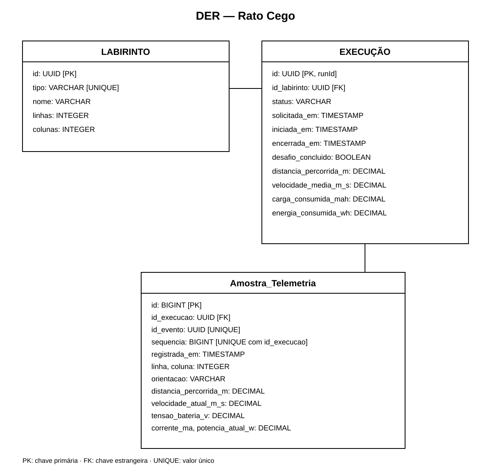

- Uma execução pode registrar zero ou muitas amostras de telemetria; cada amostra pertence a uma execução.

`MazeType` identifica a configuração escolhida (`GRID_4X4`, `GRID_8X4` ou `GRID_12X4`); as dimensões recebidas em `run.started` ficam armazenadas na execução.

**DER — Diagrama Entidade-Relacionamento**
O Diagrama Entidade-Relacionamento (DER) detalha o mapeamento JPA usado pelo PostgreSQL, incluindo chaves, colunas e restrições de unicidade.

<p align="center"><em>Figura 8 – Diagrama Entidade-Relacionamento (DER).</em></p>


Uma tentativa pode ter zero ou muitas amostras de telemetria. O trajeto é obtido ordenando as posições pelo campo `sequence`.

As restrições únicas em `telemetry_samples(run_id, sequence_number)` e `telemetry_samples(event_id)` impedem amostras repetidas. A duração é derivada de `started_at` e `finished_at`; o banco preserva também tentativas `FAILED` e `INTERRUPTED`. Quando o resultado do desafio for desconhecido, `challenge_completed` pode ser `NULL`.

### 9. Protótipo de Baixa Fidelidade

Antes do desenvolvimento do protótipo de alta fidelidade, foi elaborado um protótipo de baixa fidelidade com o objetivo de validar a arquitetura de informação e a navegação entre as páginas do sistema, sem se preocupar ainda com aspectos visuais como cores, tipografia e componentes estilizados. Essa etapa permitiu revisar rapidamente quais dados cada página deveria concentrar antes de investir tempo na fidelidade visual. O protótipo de baixa fidelidade contempla as mesmas quatro páginas definidas para o protótipo funcional:

**1. Página de Monitoramento em Tempo Real:** utilizada durante a execução, exibe o mapa em grade do labirinto com o trajeto percorrido, sem representar paredes detectadas. Também mostra o nível de bateria, alerta visual, tempo decorrido, velocidade média, estado da conexão e resultado, e permite selecionar o labirinto, preparar, iniciar, reiniciar e solicitar a interrupção da execução. As RFs relacionadas incluem: RF16, RF18, RF26–RF44.

**2. Página de Consulta Geral:** concentra as execuções armazenadas, com métricas agregadas, tabela de histórico e filtros por labirinto e status. As RFs relacionadas incluem: RF48–RF52.

**3. Página de Consulta por Labirinto:** apresenta o histórico e permite comparar tentativas de um tipo de labirinto. A RF relacionada é: RF50.

**4. Página de Detalhe da Execução:** exibe os dados armazenados de uma execução, incluindo o trajeto final e as métricas de consumo, duração e velocidade média. As RFs relacionadas incluem: RF36, RF48–RF49.

<p align="center">
  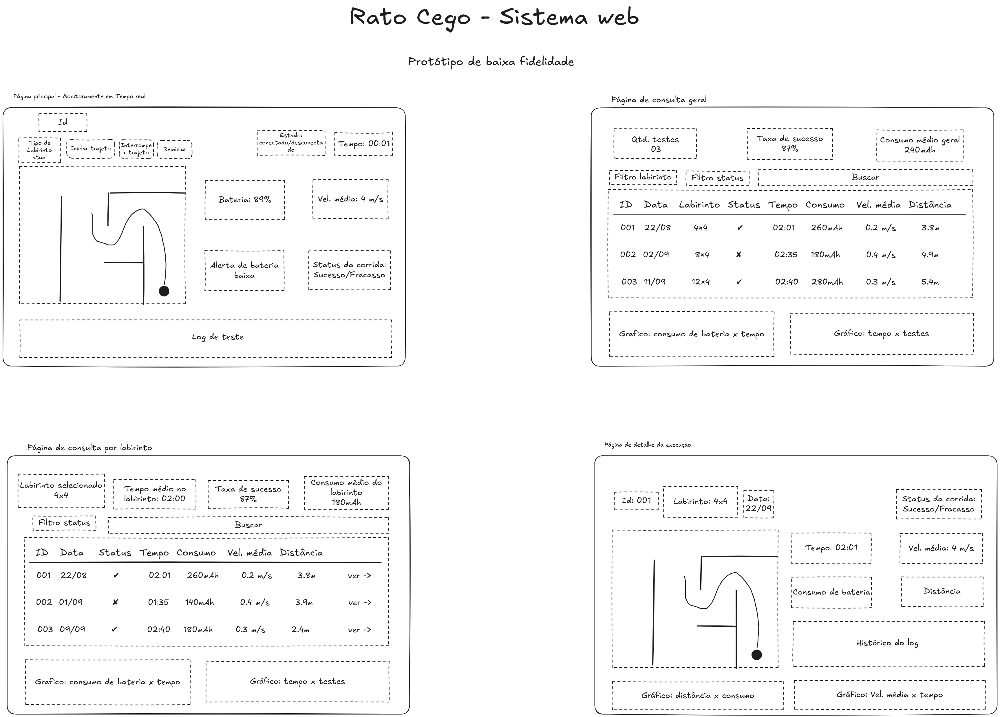
</p>

<p align="center"><em>Figura 9 – Wireframes das páginas do sistema web.</em></p>

### 10. Protótipo Funcional

O protótipo funcional foi desenvolvido com base nos requisitos funcionais que envolvem apresentação e interação na interface do sistema web. O protótipo possui quatro páginas principais:

**1. Página de Monitoramento em Tempo Real:** utilizada durante a execução, exibe o mapa em grade do labirinto com o trajeto percorrido, sem representar paredes detectadas. Também mostra o nível de bateria, alerta visual, tempo decorrido, velocidade média, estado da conexão e resultado, e permite selecionar o labirinto, preparar, iniciar, reiniciar e solicitar a interrupção da execução. As RFs relacionadas incluem: RF16, RF18, RF26–RF44.

**2. Página de Consulta Geral:** concentra as execuções armazenadas, com métricas agregadas, tabela de histórico e filtros por labirinto e status. As RFs relacionadas incluem: RF48–RF52.

**3. Página de Consulta por Labirinto:** apresenta o histórico e permite comparar tentativas de um tipo de labirinto. A RF relacionada é: RF50.

**4. Página de Detalhe da Execução:** exibe os dados armazenados de uma execução, incluindo o trajeto final e as métricas de consumo, duração e velocidade média. As RFs relacionadas incluem: RF36, RF48–RF49.

<p align="center">
  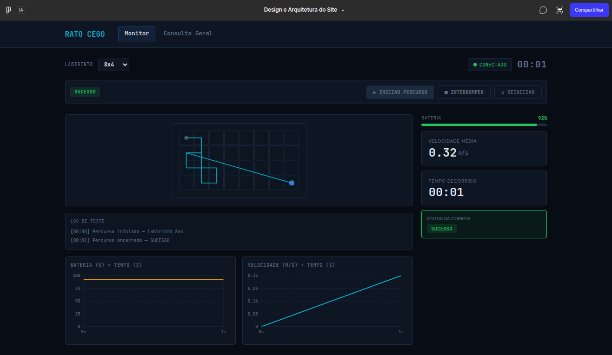
  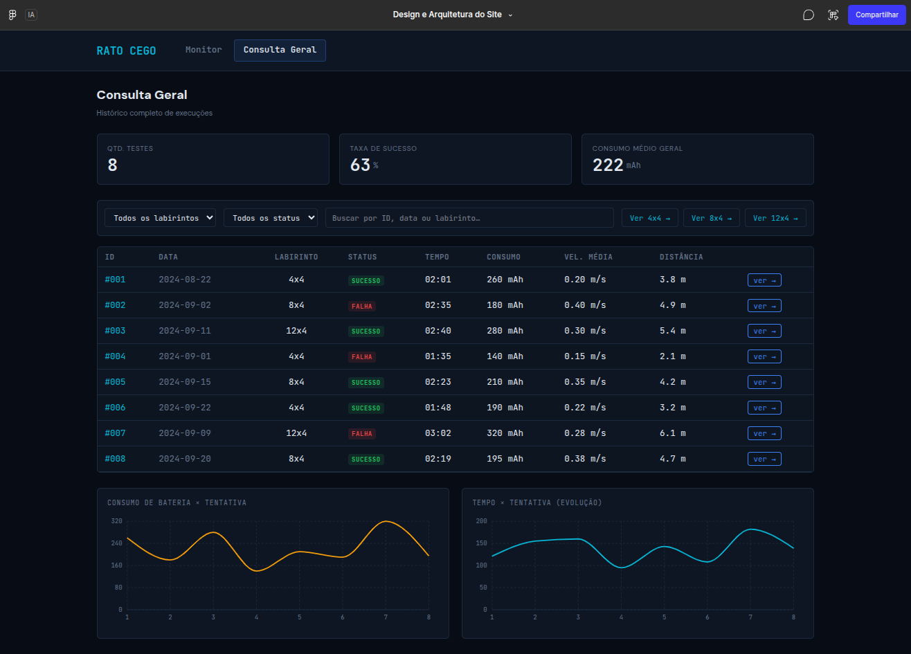
</p>

<p align="center">
  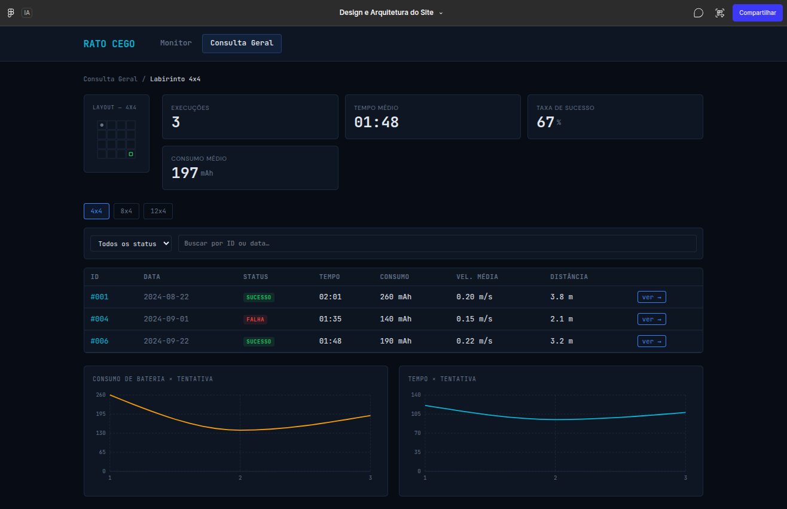
  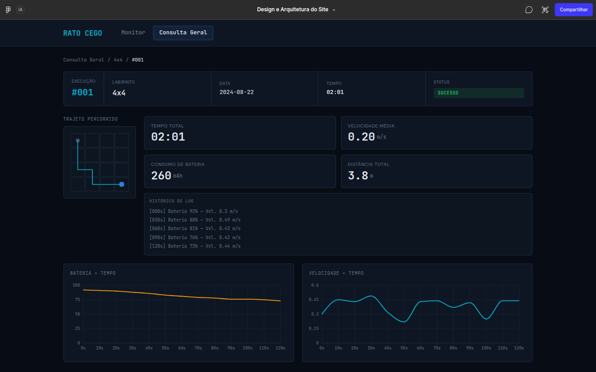
</p>

<p align="center"><em>Figura 10 – Páginas de protótipo funcional.</em></p>

<!-- parte laryssa -->

### 11. Processos e regras de tratamento

**Início da tentativa:** O frontend envia `POST /api/runs` com `mazeType`. O backend valida o tipo de labirinto, impede a criação de outra tentativa enquanto houver uma tentativa não terminal, cria um registro `Run` com status `START_REQUESTED` e publica `run.start` com o `runId`. A resposta HTTP informa o estado pendente. Ao receber `run.started` com o mesmo identificador e dimensões compatíveis com o tipo escolhido, o backend registra `started_at`, muda o status para `IN_PROGRESS` e comunica a confirmação por WebSocket. Se o prazo configurado expirar sem confirmação, registra `FAILED`.

**Recepção da telemetria:** Para cada mensagem `telemetry.sample`, o backend valida o formato e os campos obrigatórios do payload, o `runId`, o estado da tentativa, a sequência e os limites da posição conforme as dimensões confirmadas. Em seguida, persiste a amostra uma única vez, atualiza os indicadores da tentativa e envia `TELEMETRY_UPDATE`. Uma lacuna na sequência é detectada e registrada para diagnóstico; ela não deve ser preenchida com dados inventados.

A potência instantânea em watts é calculada multiplicando a tensão pela corrente em ampères. Entre duas amostras válidas, o backend estima a carga consumida integrando a corrente pelo intervalo de tempo e a energia consumida integrando a potência pelo mesmo intervalo. A velocidade média é a distância acumulada dividida pelo tempo transcorrido desde `started_at`. A primeira amostra estabelece a primeira referência temporal; uma única leitura não permite inferir o consumo anterior a ela. A interface deve distinguir uma medição indisponível de um valor igual a zero.

**Interrupção e término:** `POST /api/runs/{runId}/interrupt` altera o status da tentativa ativa para `INTERRUPT_REQUESTED` e publica `run.interrupt`. Apenas o evento `run.interrupted` confirma a parada e leva ao status `INTERRUPTED`; os dados parciais permanecem armazenados. Se um evento `run.finished` válido chegar antes, ele encerra a tentativa com o resultado informado pelo robô. A ausência de confirmação da interrupção mantém o estado pendente e gera um aviso na interface. Eventos duplicados ou tardios não podem reabrir uma tentativa em estado terminal.

**Limite de dez minutos:** O backend apresenta o tempo decorrido e pode alertar quando o limite for atingido. A equipe deve definir com o grupo responsável pelo sistema embarcado qual componente efetivamente interrompe o movimento aos dez minutos, pois uma mudança de estado apenas na aplicação web não garante a parada física do robô. O campo `challengeCompleted` deve refletir a conclusão real, confirmada pelo sistema embarcado conforme as regras do desafio.

**Consultas:** A API fornece a lista geral de tentativas, a lista filtrada por labirinto e o detalhe de uma tentativa. Na consulta de detalhe, recupera também as amostras ordenadas para desenhar o trajeto. A tela de monitoramento usa WebSocket durante a execução e pode consultar o estado atual via REST ao abrir ou reconectar, evitando depender de eventos WebSocket enviados antes da conexão.

### 12. Roteiro de testes funcionais

Os casos de teste abaixo cobrem os requisitos de software e estão relacionados às páginas do protótipo funcional. Os testes de firmware são executados com o robô no labirinto; os testes do sistema web podem usar mensagens MQTT simuladas publicadas no Mosquitto, conforme previsto na arquitetura.

#### CT-01 - Identificação de paredes

| Atributo | Descrição |
|---|---|
| Código | CT-01 |
| Nome | Identificação de paredes |
| Rastreabilidade | RF20, RNF29, RNF30, RNF37 |
| Objetivo | Verificar se o firmware identifica paredes a partir dos sensores. |
| Pré-condições | Firmware gravado no ESP32; robô dentro de uma célula do labirinto. |
| Procedimentos | 1. Posicionar paredes à frente, à esquerda e à direita, uma de cada vez. 2. Repetir sem paredes. 3. Comparar o identificado com o montado. |
| Resultado esperado | As paredes identificadas correspondem às montadas. |

#### CT-02 - Localização deslocamento e registro do trajeto

| Atributo | Descrição |
|---|---|
| Código | CT-02 |
| Nome | Localização, deslocamento e registro do trajeto |
| Rastreabilidade | RF21, RF25,  RF34, RF53|
| Objetivo | Verificar se a posição do robô é acompanhada com base nos encoders e se o trajeto é registrado. |
| Pré-condições | Tentativa em andamento; backend recebendo telemetria. |
| Procedimentos | 1. Anotar as células percorridas pelo robô. 2. Comparar com o trajeto exibido na Página de Monitoramento em Tempo Real. 3. Após o término, comparar com o trajeto final da Página de Detalhe da Execução. |
| Resultado esperado | O trajeto exibido e o registrado correspondem ao percurso real, na ordem percorrida. |

#### CT-03 - Navegação autônoma e identificação do objetivo

| Atributo | Descrição |
|---|---|
| Código | CT-03 |
| Nome | Navegação autônoma e identificação do objetivo |
| Rastreabilidade | RF22, RF23, RF24, RNF27, RNF28  |
| Objetivo | Verificar se o robô resolve o labirinto sozinho e reconhece o objetivo. |
| Pré-condições | Labirinto montado; robô na largada. |
| Procedimentos | 1. Iniciar a tentativa. 2. Acompanhar sem intervenção humana até o fim. 3. Repetir nos labirintos 4×4, 8×4 e 12×4. |
| Resultado esperado | O robô chega à área de objetivo sem intervenção, o término é informado com o desafio cumprido e cada tentativa dura até 10 minutos. |

#### CT-04 - Seleção, preparação e início da execução

| Atributo | Descrição |
|---|---|
| Código | CT-04 |
| Nome | Seleção, preparação e início da execução |
| Rastreabilidade | RF26, RF27, RF28, RF30 |
| Objetivo | Verificar se o operador seleciona o labirinto e inicia uma execução, e se o sistema impede duas execuções ao mesmo tempo. |
| Pré-condições | Mosquitto, backend e frontend em execução; Página de Monitoramento em Tempo Real aberta. |
| Procedimentos | 1. Selecionar um tipo de labirinto e solicitar o início. 2. Com a execução em andamento, solicitar um novo início. 3. Após a execução terminar, solicitar um novo início. |
| Resultado esperado | Passo 1: a execução inicia com o labirinto selecionado. Passo 2: o novo início é recusado. Passo 3: a nova execução é iniciada normalmente. |

#### CT-05 - Interrupção e parada segura

| Atributo | Descrição |
|---|---|
| Código | CT-05 |
| Nome | Interrupção e parada segura |
| Rastreabilidade | RF29, RF33 |
| Objetivo | Verificar se o operador interrompe uma execução e se o robô para com segurança. |
| Pré-condições | Execução em andamento na Página de Monitoramento em Tempo Real. |
| Procedimentos | 1. Solicitar a interrupção pela interface. 2. Observar o robô. 3. Verificar o estado exibido. |
| Resultado esperado | O robô interrompe o movimento, a execução passa para "interrompida" e os dados parciais são mantidos. |

#### CT-06 - Estados e encerramento automático da execução

| Atributo | Descrição |
|---|---|
| Código | CT-06 |
| Nome | Estados e encerramento automático da execução |
| Rastreabilidade | RF31, RF32 |
| Objetivo | Verificar se os estados da execução são exibidos e se o encerramento automático ocorre nas situações previstas. |
| Pré-condições | Sistema web em execução; Página de Monitoramento em Tempo Real aberta. |
| Procedimentos | 1. Observar o estado antes de iniciar. 2. Iniciar e observar o estado durante a corrida. 3. Deixar o robô alcançar o objetivo. 4. Iniciar sem que o robô confirme o início. 5. Manter uma execução até atingir o tempo máximo. |
| Resultado esperado | Passos 1 a 3: estados "aguardando", "em execução" e "concluída". Passo 4: estado de falha. Passo 5: execução encerrada automaticamente por tempo. |


#### CT-07 - Recepção e integridade da telemetria

| Atributo | Descrição |
|---|---|
| Código | CT-07 |
| Nome | Recepção e integridade da telemetria |
| Rastreabilidade | RF35, RF45, RF47, RNF35, RNF36, RNF38, RNF39 |
| Objetivo | Verificar se a telemetria chega ao sistema web sem alteração e se mensagens inválidas são descartadas. |
| Pré-condições | Mosquitto, backend e frontend em execução; execução em andamento. |
| Procedimentos | 1. Publicar amostras de telemetria válidas. 2. Comparar os valores exibidos com os enviados. 3. Publicar uma mensagem inválida (formato incorreto ou de outra execução). |
| Resultado esperado | A página atualiza sem ser recarregada e exibe os mesmos valores enviados; a mensagem inválida é descartada ou sinalizada sem alterar a execução. |

#### CT-08 - Exibição dos seis dados obrigatórios

| Atributo | Descrição |
|---|---|
| Código | CT-08 |
| Nome | Exibição dos seis dados obrigatórios |
| Rastreabilidade | RF36, RF37, RF38, RF39, RF40, RF16, RF18, RNF41 |
| Objetivo | Verificar se os seis dados aparecem separados e atualizados na Página de Monitoramento em Tempo Real. |
| Pré-condições | Tentativa em andamento na Página de Monitoramento em Tempo Real. |
| Procedimentos | 1. Verificar se o tipo do labirinto exibido é o selecionado. 2. Verificar se o trajeto é atualizado a cada nova posição. 3. Verificar se o consumo de bateria é atualizado a cada amostra. 4. Verificar se o tempo é contabilizado durante a corrida. 5. Verificar se a velocidade média é exibida e atualizada. 6. Enviar tensão abaixo do nível crítico e verificar o alerta de bateria. 7. Ao fim, verificar se é informado se o desafio foi cumprido (S/N). |
| Resultado esperado | Os seis dados aparecem separados e coerentes com a telemetria recebida, e o alerta de bateria aparece em nível crítico. |

#### CT-09 - Conexão, perda e reconexão WebSocket

| Atributo | Descrição |
|---|---|
| Código | CT-09 |
| Nome | Conexão, perda e reconexão WebSocket |
| Rastreabilidade | RF41, RF42, RF43, RF44, RNF31, RNF32 |
| Objetivo | Verificar se a interface se conecta, detecta a perda de conexão, avisa o operador e reconecta sozinha. |
| Pré-condições | Backend em execução; Página de Monitoramento em Tempo Real aberta. |
| Procedimentos | 1. Abrir a página e verificar a conexão. 2. Interromper o backend durante uma execução. 3. Observar a interface. 4. Restaurar o backend. |
| Resultado esperado | A conexão é estabelecida automaticamente; a perda é detectada e informada ao operador; a conexão é restabelecida sem recarregar a página, dentro dos limites dos RNF31 e RNF32. |

#### CT-10 - Perda e reconexão MQTT

| Atributo | Descrição |
|---|---|
| Código | CT-10 |
| Nome | Perda e reconexão MQTT |
| Rastreabilidade | RF45, RF46, RNF33, RNF34 |
| Objetivo | Verificar se o sistema detecta a perda do broker MQTT e se reconecta automaticamente. |
| Pré-condições | Mosquitto, backend e frontend em execução. |
| Procedimentos | 1. Interromper o Mosquitto. 2. Observar o backend e a interface. 3. Restaurar o Mosquitto. 4. Publicar nova amostra de telemetria. |
| Resultado esperado | A indisponibilidade é informada ao operador; o backend se reconecta dentro dos limites dos RNF33 e RNF34 e volta a receber a telemetria. |

#### CT-11 - Adaptação e responsividade da interface

| Atributo | Descrição |
|---|---|
| Código | CT-11 |
| Nome | Adaptação e responsividade da interface |
| Rastreabilidade | RNF40, RNF42 |
| Objetivo | Verificar se a grade se adapta aos labirintos e as páginas se adaptam a diferentes telas. |
| Pré-condições | Sistema web em execução. |
| Procedimentos | 1. Exibir execuções em 4×4, 8×4 e 12×4 na Página de Monitoramento em Tempo Real. 2. Abrir as quatro páginas em tela de computador e de celular. |
| Resultado esperado | Todas as células, o trajeto e os seis dados ficam visíveis, sem corte ou sobreposição. |

#### CT-12 - Armazenamento e associação ao labirinto

| Atributo | Descrição |
|---|---|
| Código | CT-12 |
| Nome | Armazenamento e associação ao labirinto |
| Rastreabilidade | RF48, RF49, RNF44, RNF45 |
| Objetivo | Verificar se a execução é salva e vinculada ao labirinto correto. |
| Pré-condições | Banco de dados em execução. |
| Procedimentos | 1. Concluir uma tentativa em 4×4 e outra em 8×4. 2. Localizar as duas na Página de Consulta Geral. 3. Abrir cada uma na Página de Detalhe da Execução. |
| Resultado esperado | Cada execução está salva, associada ao seu labirinto e com seus próprios dados, sem mistura entre execuções. |

#### CT-13 - Consulta por labirinto e geral

| Atributo | Descrição |
|---|---|
| Código | CT-13 |
| Nome | Consulta por labirinto e geral |
| Rastreabilidade | RF50, RF51 |
| Objetivo | Verificar as consultas do histórico. |
| Pré-condições | Banco com execuções em mais de um labirinto. |
| Procedimentos | 1. Na Página de Consulta por Labirinto, selecionar um labirinto. 2. Na Página de Consulta Geral, consultar todas as execuções. |
| Resultado esperado | A consulta por labirinto mostra só as execuções do labirinto escolhido; a consulta geral mostra todas. |

#### CT-14 - Registro de falhas da execução

| Atributo | Descrição |
|---|---|
| Código | CT-14 |
| Nome | Registro de falhas da execução |
| Rastreabilidade | RF52 |
| Objetivo | Verificar se execuções encerradas por falha, timeout ou interrupção ficam registradas. |
| Pré-condições | Banco de dados em execução. |
| Procedimentos | 1. Provocar uma falha de início (robô não confirma). 2. Interromper uma execução em andamento. 3. Consultar as duas na Página de Consulta Geral. |
| Resultado esperado | As duas execuções aparecem no histórico com o estado correspondente (falha e interrompida). |

#### CT-15 - Calibração dos sensores

| Atributo | Descrição |
|---|---|
| Código | CT-15 |
| Nome | Calibração dos sensores |
| Rastreabilidade | RF54 |
| Objetivo | Verificar se os sensores podem ser calibrados antes da operação. |
| Pré-condições | Procedimento de calibração definido pelo projeto; robô no labirinto. |
| Procedimentos | 1. Executar o procedimento de calibração. 2. Repetir o CT-01. |
| Resultado esperado | A calibração é concluída e as paredes continuam sendo identificadas corretamente. |

#### CT-16 - Sinalização do ciclo de recarga

| Atributo | Descrição |
|---|---|
| Código | CT-16 |
| Nome | Sinalização do ciclo de recarga |
| Rastreabilidade | RF55 |
| Objetivo | Verificar se o robô indica visualmente o estado da recarga. |
| Pré-condições |  Bateria parcialmente descarregada; carregador disponível. |
| Procedimentos | 1. Conectar o carregador e observar a sinalização. 2. Observar novamente ao fim da carga.  |
| Resultado esperado | A sinalização muda conforme o estado do ciclo de carregamento. |


### 13. Matriz de rastreabilidade

Tabela 1 – Matriz de rastreabilidade entre requisitos, protótipo e casos de teste

| Requisito | HU | Página do protótipo | Caso de teste |
|---|---|---|---| 
| RF20 | HU20 | (firmware) | CT-01 |
| RF21, RF25 | HU21, HU25 | Monitoramento em Tempo Real; Detalhe da Execução | CT-02 |
| RF34, RF53 | HU34, HU53 | (firmware) | CT-02 |
| RF22, RF23, RF24 | HU22, HU23, HU24 | (firmware) | CT-03 |
| RF26, RF27, RF28, RF30 | HU26, HU27, HU28, HU30 | Monitoramento em Tempo Real | CT-04 |
| RF29, RF33 | HU29, HU33 | Monitoramento em Tempo Real | CT-05 |
| RF31, RF32 | HU31, HU32 | Monitoramento em Tempo Real | CT-06 |
| RF35, RF45, RF47 | HU35, HU45, HU47 | Monitoramento em Tempo Real | CT-07 |
| RF36 a RF40, RF16, RF18 | HU36 a HU40, HU16, HU18 | Monitoramento em Tempo Real | CT-08 |
| RF41, RF42, RF43, RF44 | HU41, HU42, HU43, HU44 | Monitoramento em Tempo Real | CT-09 |
| RF46 | HU46 | Monitoramento em Tempo Real | CT-10 |
| RF48, RF49 | HU48, HU49 | Consulta Geral; Detalhe da Execução | CT-12 |
| RF50 | HU50 | Consulta por Labirinto | CT-13 |
| RF51 | HU51 | Consulta Geral | CT-13 |
| RF52 | HU52 | Consulta Geral | CT-14 |
| RF54 | HU54 | (firmware) | CT-15 |
| RF55 | HU55 | (firmware) | CT-16 |
| RNF40, RNF42 | - | Todas as páginas | CT-11 |
| RNF43 | - | - | Verificação por inspeção da arquitetura |

Fonte: Elaborado pelos autores (2026).

## Backlog do Produto

O backlog do produto é acompanhado no [GitHub Projects](https://github.com/orgs/fcte-pi1/projects/59). As histórias detalhadas, critérios de aceitação e protótipos vinculados estão nas issues de HU. A especificação completa de RFs e RNFs está em [Requisitos](Requisitos.md).

### Histórias de Usuário

Este documento apresenta as **Histórias de Usuário (HUs)** do projeto **Micromouse**, elaboradas a partir dos Requisitos Funcionais (RFs) definidos para o sistema. Os requisitos atuais definem 55 RFs, representados aqui por 55 histórias para facilitar a rastreabilidade.

As histórias representam resultados para operadores e integrantes da equipe responsáveis por desenvolver, integrar e manter o sistema. Quando o requisito descreve uma capacidade interna, a história identifica esse papel responsável, sem tratar o próprio sistema ou um componente como usuário humano.

Cada RF possui uma HU correspondente nesta versão. Essa relação 1:1 é uma escolha de rastreabilidade para o escopo atual, não uma regra geral de decomposição: se um RF vier a exigir resultados independentes, poderá ser relacionado a mais de uma HU sem alterar o requisito. Os Requisitos Não Funcionais (RNFs) não possuem HUs próprias; são restrições e condições de qualidade associadas às histórias que ajudam a satisfazê-los. A cobertura e as associações devem ser confirmadas nos critérios de aceitação das issues.

Os **critérios de aceitação** de cada História de Usuário serão definidos posteriormente nas respectivas **Issues** do projeto.

---

## Organização das Histórias de Usuário

As HUs estão organizadas segundo os sete agrupamentos usados em `Requisitos.md`, para manter a correspondência com a organização dos RFs. Alguns agrupamentos são transversais ou reúnem capacidades próximas por conveniência de rastreabilidade; a classificação não implica que toda HU do grupo pertença a um único subsistema técnico.

| Épico | Descrição | HUs |
|---|---|---|
| **ÉPICO 1** | Estrutura do Micromouse | HU01–HU08 |
| **ÉPICO 2** | Hardware e Sensoriamento | HU09–HU15 |
| **ÉPICO 3** | Alimentação e Energia | HU16–HU19 |
| **ÉPICO 4** | Navegação e Controle | HU20–HU34 |
| **ÉPICO 5** | Sistema Web e Telemetria | HU35–HU47 |
| **ÉPICO 6** | Banco de Dados e Histórico | HU48–HU52 |
| **ÉPICO 7** | Integração e Validação | HU53–HU55 |

### Prioridades

As prioridades utilizadas nas histórias são:

- **Must** — funcionalidade essencial para o funcionamento do sistema.
- **Should** — funcionalidade importante, mas que pode ser implementada posteriormente caso necessário.
- **Could** — funcionalidade desejável, mas de menor prioridade.

### Delimitação entre histórias relacionadas

- **HU09 e HU20:** HU09 cobre a amostragem do ambiente pelos sensores e a detecção de paredes e aberturas; HU20 cobre a interpretação dessas leituras pelo software para representar quais paredes estão presentes.
- **HU10, HU22 e HU23:** HU10 cobre a execução embarcada local e a manutenção das informações necessárias; HU22 cobre a decisão dos próximos movimentos; HU23 cobre a execução autônoma do percurso sem intervenção humana após o início.
- **HU14 e HU35:** HU14 cobre a transmissão sem fio a partir do Micromouse; HU35 cobre a recepção e disponibilização dos dados na aplicação web.
- **HU16, HU18 e HU37:** HU16 cobre a coleta e associação dos dados energéticos à execução; HU18 cobre o aviso de bateria baixa; HU37 cobre a visualização da condição e do consumo na interface.
- **HU25, HU36 e HU48:** HU25 cobre o registro do trajeto durante a execução; HU36 cobre sua visualização durante o percurso; HU48 cobre o armazenamento dos dados da execução após o percurso.
- **HU34 e HU53:** HU34 cobre a obtenção de medidas de deslocamento e velocidade pelos encoders; HU53 cobre o uso dessas medidas para auxiliar o controle e corrigir a movimentação.

---

#### ÉPICO 1 — Estrutura do Micromouse

Este épico reúne as histórias relacionadas à construção física do Micromouse, incluindo proteção, fixação, modularidade, organização dos componentes, cabeamento e acesso aos elementos internos e externos.

| HU | História de Usuário | RF relacionado | Prioridade | RNFs relacionados |
|---|---|---|---|---|
| <a id="hu01"></a>**HU01** | **Como** integrante da equipe de desenvolvimento, **quero** que a estrutura do Micromouse proteja seus componentes internos, **para** evitar danos aos componentes eletrônicos durante a operação e possíveis colisões no labirinto. | [RF1](Requisitos.md#rf1) | **Must** | [RNF1](Requisitos.md#rnf1), [RNF4](Requisitos.md#rnf4), [RNF5](Requisitos.md#rnf5), [RNF10](Requisitos.md#rnf10) |
| <a id="hu02"></a>**HU02** | **Como** integrante da equipe de desenvolvimento, **quero** ter acesso aos componentes internos do Micromouse, **para** realizar inspeções, manutenção, substituições e ajustes sem precisar desmontar completamente o chassi. | [RF2](Requisitos.md#rf2) | **Should** | [RNF12](Requisitos.md#rnf12), [RNF13](Requisitos.md#rnf13) |
| <a id="hu03"></a>**HU03** | **Como** integrante da equipe de desenvolvimento, **quero** que os subsistemas possuam pontos adequados de fixação, **para** evitar deslocamentos dos componentes durante o funcionamento. | [RF3](Requisitos.md#rf3) | **Must** | [RNF5](Requisitos.md#rnf5), [RNF6](Requisitos.md#rnf6), [RNF8](Requisitos.md#rnf8) |
| <a id="hu04"></a>**HU04** | **Como** integrante da equipe de desenvolvimento, **quero** que a estrutura seja modular, **para** permitir a substituição ou atualização de módulos sem reconstruir completamente o chassi. | [RF4](Requisitos.md#rf4) | **Should** | [RNF8](Requisitos.md#rnf8), [RNF12](Requisitos.md#rnf12), [RNF13](Requisitos.md#rnf13) |
| <a id="hu05"></a>**HU05** | **Como** integrante da equipe de desenvolvimento, **quero** que motores, rodas e demais elementos de tração sejam corretamente fixados e alinhados, **para** garantir uma movimentação estável e previsível. | [RF5](Requisitos.md#rf5) | **Must** | [RNF5](Requisitos.md#rnf5), [RNF6](Requisitos.md#rnf6), [RNF7](Requisitos.md#rnf7) |
| <a id="hu06"></a>**HU06** | **Como** integrante da equipe de desenvolvimento, **quero** que os sensores possuam espaços e pontos de fixação adequados, **para** manter seu posicionamento e orientação corretos durante a navegação. | [RF6](Requisitos.md#rf6) | **Must** | [RNF8](Requisitos.md#rnf8), [RNF13](Requisitos.md#rnf13), [RNF37](Requisitos.md#rnf37) |
| <a id="hu07"></a>**HU07** | **Como** integrante da equipe de desenvolvimento, **quero** que os cabos sejam organizados e protegidos, **para** evitar interferências com rodas, motores, sensores e demais componentes. | [RF7](Requisitos.md#rf7) | **Must** | [RNF8](Requisitos.md#rnf8), [RNF10](Requisitos.md#rnf10), [RNF15](Requisitos.md#rnf15) |
| <a id="hu08"></a>**HU08** | **Como** operador, **quero** ter acesso aos interruptores, conectores e interfaces externas, **para** operar e realizar a manutenção do Micromouse sem precisar desmontar sua estrutura. | [RF8](Requisitos.md#rf8) | **Should** | [RNF10](Requisitos.md#rnf10), [RNF12](Requisitos.md#rnf12) |

---

#### ÉPICO 2 — Hardware e Sensoriamento

Este épico reúne as histórias relacionadas aos componentes eletrônicos responsáveis pela percepção do ambiente, processamento embarcado, acionamento dos motores, comunicação, alimentação e interface de operação pela aplicação web.

| HU | História de Usuário | RF relacionado | Prioridade | RNFs relacionados |
|---|---|---|---|---|
| <a id="hu09"></a>**HU09** | **Como** integrante da equipe de desenvolvimento, **quero** que o Micromouse amostre continuamente o ambiente e detecte paredes de aproximadamente 5 cm e aberturas nas direções frontal e lateral, **para** fornecer as leituras necessárias à navegação. | [RF9](Requisitos.md#rf9) | **Must** | [RNF17](Requisitos.md#rnf17), [RNF28](Requisitos.md#rnf28), [RNF37](Requisitos.md#rnf37) |
| <a id="hu10"></a>**HU10** | **Como** integrante da equipe de desenvolvimento, **quero** que o microcontrolador processe localmente as leituras, execute a lógica de controle e navegação e armazene localmente as informações necessárias à navegação, **para** operar sem depender de processamento externo. | [RF10](Requisitos.md#rf10) | **Must** | [RNF17](Requisitos.md#rnf17), [RNF29](Requisitos.md#rnf29), [RNF30](Requisitos.md#rnf30) |
| <a id="hu11"></a>**HU11** | **Como** integrante da equipe de desenvolvimento, **quero** que o sistema converta comandos lógicos em acionamento reversível dos motores e controle contínuo da velocidade por PWM, **para** executar os movimentos necessários durante a navegação. | [RF11](Requisitos.md#rf11) | **Must** | [RNF17](Requisitos.md#rnf17), [RNF23](Requisitos.md#rnf23), [RNF26](Requisitos.md#rnf26) |
| <a id="hu12"></a>**HU12** | **Como** integrante da equipe de desenvolvimento, **quero** que o sistema ajuste diferencialmente os motores durante o deslocamento, **para** manter uma trajetória reta e centralizada entre as paredes. | [RF12](Requisitos.md#rf12) | **Must** | [RNF17](Requisitos.md#rnf17), [RNF37](Requisitos.md#rnf37) |
| <a id="hu13"></a>**HU13** | **Como** integrante da equipe de desenvolvimento, **quero** que o sistema execute curvas de 90° e 180° respeitando as dimensões das células, **para** mudar de direção e percorrer diferentes caminhos do labirinto. | [RF13](Requisitos.md#rf13) | **Must** | [RNF2](Requisitos.md#rnf2), [RNF28](Requisitos.md#rnf28), [RNF29](Requisitos.md#rnf29), [RNF30](Requisitos.md#rnf30) |
| <a id="hu14"></a>**HU14** | **Como** integrante responsável pela integração, **quero** que o Micromouse transmita sem fio os dados necessários à telemetria durante a execução, **para** que a aplicação de monitoramento possa recebê-los. | [RF14](Requisitos.md#rf14) | **Must** | [RNF31](Requisitos.md#rnf31), [RNF33](Requisitos.md#rnf33), [RNF36](Requisitos.md#rnf36), [RNF39](Requisitos.md#rnf39) |
| <a id="hu15"></a>**HU15** | **Como** integrante da equipe de desenvolvimento, **quero** que a fonte de energia forneça tensões reguladas e estáveis, **para** garantir o funcionamento adequado dos componentes eletrônicos, sensores e atuadores. | [RF15](Requisitos.md#rf15) | **Must** | [RNF15](Requisitos.md#rnf15), [RNF16](Requisitos.md#rnf16), [RNF23](Requisitos.md#rnf23), [RNF26](Requisitos.md#rnf26) |

---

#### ÉPICO 3 — Alimentação e Energia

Este épico reúne as histórias relacionadas ao fornecimento, monitoramento, isolamento e manutenção da alimentação elétrica do Micromouse.

| HU | História de Usuário | RF relacionado | Prioridade | RNFs relacionados |
|---|---|---|---|---|
| <a id="hu16"></a>**HU16** | **Como** operador, **quero** acompanhar os dados de consumo e condição da bateria em tempo real e vinculados à execução correspondente, **para** monitorar o estado energético de cada tentativa. | [RF16](Requisitos.md#rf16) | **Must** | [RNF18](Requisitos.md#rnf18), [RNF21](Requisitos.md#rnf21), [RNF25](Requisitos.md#rnf25) |
| <a id="hu17"></a>**HU17** | **Como** integrante da equipe de desenvolvimento, **quero** que um interruptor físico acessível desconecte a bateria dos subsistemas, **para** garantir segurança durante transporte, montagem e manutenção. | [RF17](Requisitos.md#rf17) | **Must** | [RNF15](Requisitos.md#rnf15), [RNF24](Requisitos.md#rnf24) |
| <a id="hu18"></a>**HU18** | **Como** operador, **quero** receber na interface web um aviso quando qualquer célula da bateria atingir o nível crítico definido, **para** agir antes que a descarga alcance uma faixa prejudicial à bateria. | [RF18](Requisitos.md#rf18) | **Must** | [RNF21](Requisitos.md#rnf21), [RNF36](Requisitos.md#rnf36), [RNF38](Requisitos.md#rnf38) |
| <a id="hu19"></a>**HU19** | **Como** integrante da equipe de desenvolvimento, **quero** remover e reinstalar a bateria sem desmontar o chassi, **para** facilitar sua manutenção e substituição. | [RF19](Requisitos.md#rf19) | **Could** | [RNF12](Requisitos.md#rnf12), [RNF22](Requisitos.md#rnf22), [RNF26](Requisitos.md#rnf26) |

---

#### ÉPICO 4 — Navegação e Controle

Este épico reúne as histórias relacionadas à percepção do labirinto, localização, planejamento e execução do percurso, gerenciamento da execução e controle da movimentação.

| HU | História de Usuário | RF relacionado | Prioridade | RNFs relacionados |
|---|---|---|---|---|
| <a id="hu20"></a>**HU20** | **Como** integrante da equipe de desenvolvimento, **quero** que o software classifique como presentes ou ausentes as paredes a partir das leituras dos sensores, **para** disponibilizar essa representação à navegação. | [RF20](Requisitos.md#rf20) | **Must** | [RNF28](Requisitos.md#rnf28), [RNF37](Requisitos.md#rnf37) |
| <a id="hu21"></a>**HU21** | **Como** integrante da equipe de desenvolvimento, **quero** que o sistema acompanhe a posição do Micromouse no labirinto durante a execução, **para** utilizar essa informação na navegação e no registro do percurso. | [RF21](Requisitos.md#rf21) | **Must** | [RNF28](Requisitos.md#rnf28), [RNF29](Requisitos.md#rnf29), [RNF37](Requisitos.md#rnf37) |
| <a id="hu22"></a>**HU22** | **Como** integrante da equipe de desenvolvimento, **quero** que o sistema determine os próximos movimentos com base nas informações do ambiente, **para** decidir o percurso a seguir no labirinto. | [RF22](Requisitos.md#rf22) | **Must** | [RNF27](Requisitos.md#rnf27), [RNF28](Requisitos.md#rnf28), [RNF30](Requisitos.md#rnf30) |
| <a id="hu23"></a>**HU23** | **Como** operador, **quero** que, uma vez iniciada a execução, o Micromouse percorra o labirinto sem intervenção humana, **para** realizar o desafio de forma autônoma. | [RF23](Requisitos.md#rf23) | **Must** | [RNF27](Requisitos.md#rnf27), [RNF28](Requisitos.md#rnf28), [RNF29](Requisitos.md#rnf29), [RNF30](Requisitos.md#rnf30) |
| <a id="hu24"></a>**HU24** | **Como** operador, **quero** que o sistema identifique quando o Micromouse alcançar a região objetivo, **para** determinar a conclusão do percurso. | [RF24](Requisitos.md#rf24) | **Must** | [RNF27](Requisitos.md#rnf27), [RNF28](Requisitos.md#rnf28) |
| <a id="hu25"></a>**HU25** | **Como** operador, **quero** que o trajeto percorrido seja registrado durante cada execução, **para** acompanhá-lo e disponibilizá-lo para consulta posterior. | [RF25](Requisitos.md#rf25) | **Must** | [RNF39](Requisitos.md#rnf39), [RNF44](Requisitos.md#rnf44), [RNF45](Requisitos.md#rnf45) |
| <a id="hu26"></a>**HU26** | **Como** operador, **quero** selecionar o tipo de labirinto antes da execução, **para** configurar o sistema de acordo com o desafio a ser realizado. | [RF26](Requisitos.md#rf26) | **Must** | [RNF28](Requisitos.md#rnf28), [RNF40](Requisitos.md#rnf40) |
| <a id="hu27"></a>**HU27** | **Como** operador, **quero** que o sistema verifique as condições necessárias antes de iniciar a execução, **para** evitar o início do percurso quando alguma condição obrigatória estiver indisponível. | [RF27](Requisitos.md#rf27) | **Must** | [RNF18](Requisitos.md#rnf18), [RNF26](Requisitos.md#rnf26), [RNF28](Requisitos.md#rnf28) |
| <a id="hu28"></a>**HU28** | **Como** operador, **quero** iniciar o percurso pela interface web após a preparação e receber `run.started` em até 5 segundos, **para** saber que a tentativa começou; se não houver confirmação, a tentativa deve ser encerrada como falha de início. | [RF28](Requisitos.md#rf28) | **Must** | [RNF27](Requisitos.md#rnf27) |
| <a id="hu29"></a>**HU29** | **Como** operador, **quero** solicitar pela interface web a interrupção de uma execução e receber `run.interrupted` em até 2 segundos, **para** saber se a parada foi confirmada; sem confirmação, devo ser informado e o estado deve permanecer pendente. | [RF29](Requisitos.md#rf29) | **Must** | [RNF24](Requisitos.md#rnf24) |
| <a id="hu30"></a>**HU30** | **Como** operador, **quero** iniciar uma nova execução após a conclusão ou interrupção de uma tentativa, **para** realizar novas tentativas sem precisar reinicializar manualmente todo o sistema. | [RF30](Requisitos.md#rf30) | **Should** | [RNF27](Requisitos.md#rnf27), [RNF44](Requisitos.md#rnf44) |
| <a id="hu31"></a>**HU31** | **Como** operador, **quero** que o sistema mantenha e disponibilize o estado atual da execução, **para** saber se o Micromouse está aguardando, executando, concluído, interrompido ou em situação de falha ou timeout. | [RF31](Requisitos.md#rf31) | **Must** | [RNF35](Requisitos.md#rnf35), [RNF39](Requisitos.md#rnf39) |
| <a id="hu32"></a>**HU32** | **Como** integrante da equipe de desenvolvimento, **quero** que o sistema encerre automaticamente a execução quando o objetivo for alcançado, o tempo máximo for excedido ou ocorrer uma falha que impeça a continuidade segura, **para** garantir um encerramento definido para cada tentativa. | [RF32](Requisitos.md#rf32) | **Must** | [RNF27](Requisitos.md#rnf27) |
| <a id="hu33"></a>**HU33** | **Como** integrante da equipe de desenvolvimento, **quero** que o sistema interrompa ou limite de forma segura o acionamento dos motores quando houver interrupção ou falha, **para** evitar movimentos inadequados e proteger o Micromouse. | [RF33](Requisitos.md#rf33) | **Must** | [RNF17](Requisitos.md#rnf17), [RNF24](Requisitos.md#rnf24) |
| <a id="hu34"></a>**HU34** | **Como** integrante da equipe de desenvolvimento, **quero** que o sistema use os encoders dos motores para medir deslocamento e velocidade, **para** auxiliar o controle e a navegação. | [RF34](Requisitos.md#rf34) | **Must** | [RNF17](Requisitos.md#rnf17), [RNF29](Requisitos.md#rnf29) |

---

#### ÉPICO 5 — Sistema Web e Telemetria

Este épico reúne as histórias relacionadas à comunicação entre o Micromouse e a aplicação web, transmissão de telemetria, monitoramento da execução, WebSocket e MQTT.

| HU | História de Usuário | RF relacionado | Prioridade | RNFs relacionados |
|---|---|---|---|---|
| <a id="hu35"></a>**HU35** | **Como** operador, **quero** que a aplicação web receba e disponibilize a telemetria enviada pelo Micromouse, **para** acompanhar a execução em tempo real. | [RF35](Requisitos.md#rf35) | **Must** | [RNF36](Requisitos.md#rnf36), [RNF38](Requisitos.md#rnf38), [RNF39](Requisitos.md#rnf39) |
| <a id="hu36"></a>**HU36** | **Como** operador, **quero** visualizar na aplicação web o trajeto realizado pelo Micromouse, **para** acompanhar seu deslocamento durante a execução. | [RF36](Requisitos.md#rf36) | **Must** | [RNF38](Requisitos.md#rnf38), [RNF40](Requisitos.md#rnf40), [RNF41](Requisitos.md#rnf41) |
| <a id="hu37"></a>**HU37** | **Como** operador, **quero** visualizar na aplicação web a condição e o consumo da bateria, **para** acompanhar o estado energético do Micromouse. | [RF37](Requisitos.md#rf37) | **Must** | [RNF21](Requisitos.md#rnf21), [RNF25](Requisitos.md#rnf25), [RNF38](Requisitos.md#rnf38), [RNF41](Requisitos.md#rnf41) |
| <a id="hu38"></a>**HU38** | **Como** operador, **quero** acompanhar o tempo de execução na aplicação web, **para** saber a duração do percurso realizado. | [RF38](Requisitos.md#rf38) | **Must** | [RNF27](Requisitos.md#rnf27), [RNF38](Requisitos.md#rnf38), [RNF41](Requisitos.md#rnf41) |
| <a id="hu39"></a>**HU39** | **Como** operador, **quero** visualizar a velocidade média na aplicação web, **para** acompanhar o desempenho do Micromouse durante a execução. | [RF39](Requisitos.md#rf39) | **Must** | [RNF38](Requisitos.md#rnf38), [RNF39](Requisitos.md#rnf39), [RNF41](Requisitos.md#rnf41) |
| <a id="hu40"></a>**HU40** | **Como** operador, **quero** visualizar o resultado do desafio na aplicação web, **para** saber se o percurso foi concluído. | [RF40](Requisitos.md#rf40) | **Must** | [RNF41](Requisitos.md#rnf41), [RNF44](Requisitos.md#rnf44), [RNF45](Requisitos.md#rnf45) |
| <a id="hu41"></a>**HU41** | **Como** integrante responsável pela integração, **quero** que a aplicação web estabeleça uma conexão WebSocket com o serviço de comunicação em tempo real, **para** receber e disponibilizar continuamente as informações da execução. | [RF41](Requisitos.md#rf41) | **Must** | [RNF31](Requisitos.md#rnf31), [RNF36](Requisitos.md#rnf36) |
| <a id="hu42"></a>**HU42** | **Como** integrante responsável pela integração, **quero** que o sistema detecte a perda ou indisponibilidade do WebSocket e a diferencie de uma telemetria desatualizada, **para** identificar corretamente a condição da comunicação durante uma execução. | [RF42](Requisitos.md#rf42) | **Must** | [RNF31](Requisitos.md#rnf31), [RNF36](Requisitos.md#rnf36) |
| <a id="hu43"></a>**HU43** | **Como** operador, **quero** que a aplicação tente restabelecer automaticamente o WebSocket enquanto a página de monitoramento estiver aberta, **para** recuperar o acompanhamento após uma perda de conexão. | [RF43](Requisitos.md#rf43) | **Should** | [RNF32](Requisitos.md#rnf32) |
| <a id="hu44"></a>**HU44** | **Como** operador, **quero** ser informado quando uma comunicação necessária estiver indisponível, **para** saber que os dados podem estar temporariamente indisponíveis. | [RF44](Requisitos.md#rf44) | **Must** | [RNF31](Requisitos.md#rnf31), [RNF32](Requisitos.md#rnf32), [RNF36](Requisitos.md#rnf36) |
| <a id="hu45"></a>**HU45** | **Como** integrante responsável pela integração, **quero** que os componentes troquem por MQTT as mensagens previstas na arquitetura, **para** viabilizar a comunicação entre as partes do sistema. | [RF45](Requisitos.md#rf45) | **Must** | [RNF33](Requisitos.md#rnf33), [RNF35](Requisitos.md#rnf35) |
| <a id="hu46"></a>**HU46** | **Como** integrante responsável pela integração, **quero** que o cliente MQTT tente restabelecer automaticamente a conexão após uma perda, **para** recuperar a troca de informações entre os componentes. | [RF46](Requisitos.md#rf46) | **Must** | [RNF33](Requisitos.md#rnf33), [RNF34](Requisitos.md#rnf34) |
| <a id="hu47"></a>**HU47** | **Como** integrante responsável pela integração, **quero** que as mensagens MQTT sejam recebidas, validadas e processadas conforme o formato definido, **para** impedir que mensagens inválidas sejam usadas pelo sistema. | [RF47](Requisitos.md#rf47) | **Must** | [RNF35](Requisitos.md#rnf35) |

---

#### ÉPICO 6 — Banco de Dados e Histórico

Este épico reúne as histórias relacionadas ao armazenamento, organização e consulta dos dados gerados durante as execuções do Micromouse.

| HU | História de Usuário | RF relacionado | Prioridade | RNFs relacionados |
|---|---|---|---|---|
| <a id="hu48"></a>**HU48** | **Como** operador, **quero** que os dados de cada execução sejam armazenados após o percurso, **para** manter um histórico das execuções realizadas. | [RF48](Requisitos.md#rf48) | **Must** | [RNF44](Requisitos.md#rnf44), [RNF45](Requisitos.md#rnf45) |
| <a id="hu49"></a>**HU49** | **Como** operador, **quero** que cada execução armazenada seja associada ao tipo de labirinto utilizado, **para** identificar a configuração correspondente à execução. | [RF49](Requisitos.md#rf49) | **Must** | [RNF44](Requisitos.md#rnf44), [RNF45](Requisitos.md#rnf45) |
| <a id="hu50"></a>**HU50** | **Como** operador, **quero** consultar as execuções de determinado tipo de labirinto, **para** analisar o histórico daquela configuração. | [RF50](Requisitos.md#rf50) | **Must** | [RNF44](Requisitos.md#rnf44), [RNF45](Requisitos.md#rnf45) |
| <a id="hu51"></a>**HU51** | **Como** operador, **quero** consultar os dados de diferentes labirintos e execuções, **para** acessar o histórico geral do sistema. | [RF51](Requisitos.md#rf51) | **Must** | [RNF44](Requisitos.md#rnf44), [RNF45](Requisitos.md#rnf45) |
| <a id="hu52"></a>**HU52** | **Como** operador, **quero** que eventos relevantes que impeçam ou interrompam uma execução sejam registrados, **para** identificar as ocorrências que afetaram o percurso. | [RF52](Requisitos.md#rf52) | **Must** | [RNF44](Requisitos.md#rnf44), [RNF45](Requisitos.md#rnf45) |

---

#### ÉPICO 7 — Integração e Validação

Este épico reúne as histórias relacionadas à integração dos subsistemas e aos procedimentos necessários para garantir o funcionamento adequado do Micromouse.

| HU | História de Usuário | RF relacionado | Prioridade | RNFs relacionados |
|---|---|---|---|---|
| <a id="hu53"></a>**HU53** | **Como** integrante da equipe de desenvolvimento, **quero** que o sistema use as medidas de deslocamento dos encoders para auxiliar o controle e o posicionamento, **para** corrigir desvios e melhorar a precisão da movimentação durante a navegação. | [RF53](Requisitos.md#rf53) | **Must** | [RNF17](Requisitos.md#rnf17), [RNF29](Requisitos.md#rnf29) |
| <a id="hu54"></a>**HU54** | **Como** integrante da equipe de desenvolvimento, **quero** calibrar os sensores antes da operação conforme o procedimento definido, **para** garantir leituras adequadas durante a navegação. | [RF54](Requisitos.md#rf54) | **Should** | [RNF37](Requisitos.md#rnf37) |
| <a id="hu55"></a>**HU55** | **Como** operador, **quero** que o Micromouse indique visualmente o estado do ciclo de recarga, **para** acompanhar o processo de carregamento. | [RF55](Requisitos.md#rf55) | **Could** | [RNF18](Requisitos.md#rnf18) |

---

#### Matriz de Rastreabilidade

A matriz abaixo apresenta a relação entre cada História de Usuário, seu respectivo Requisito Funcional e os Requisitos Não Funcionais associados.

| HU | RF | RNFs |
|---|---|---|
| [HU01](#hu01) | [RF1](Requisitos.md#rf1) | [RNF1](Requisitos.md#rnf1), [RNF4](Requisitos.md#rnf4), [RNF5](Requisitos.md#rnf5), [RNF10](Requisitos.md#rnf10) |
| [HU02](#hu02) | [RF2](Requisitos.md#rf2) | [RNF12](Requisitos.md#rnf12), [RNF13](Requisitos.md#rnf13) |
| [HU03](#hu03) | [RF3](Requisitos.md#rf3) | [RNF5](Requisitos.md#rnf5), [RNF6](Requisitos.md#rnf6), [RNF8](Requisitos.md#rnf8) |
| [HU04](#hu04) | [RF4](Requisitos.md#rf4) | [RNF8](Requisitos.md#rnf8), [RNF12](Requisitos.md#rnf12), [RNF13](Requisitos.md#rnf13) |
| [HU05](#hu05) | [RF5](Requisitos.md#rf5) | [RNF5](Requisitos.md#rnf5), [RNF6](Requisitos.md#rnf6), [RNF7](Requisitos.md#rnf7) |
| [HU06](#hu06) | [RF6](Requisitos.md#rf6) | [RNF8](Requisitos.md#rnf8), [RNF13](Requisitos.md#rnf13), [RNF37](Requisitos.md#rnf37) |
| [HU07](#hu07) | [RF7](Requisitos.md#rf7) | [RNF8](Requisitos.md#rnf8), [RNF10](Requisitos.md#rnf10), [RNF15](Requisitos.md#rnf15) |
| [HU08](#hu08) | [RF8](Requisitos.md#rf8) | [RNF10](Requisitos.md#rnf10), [RNF12](Requisitos.md#rnf12) |
| [HU09](#hu09) | [RF9](Requisitos.md#rf9) | [RNF17](Requisitos.md#rnf17), [RNF28](Requisitos.md#rnf28), [RNF37](Requisitos.md#rnf37) |
| [HU10](#hu10) | [RF10](Requisitos.md#rf10) | [RNF17](Requisitos.md#rnf17), [RNF29](Requisitos.md#rnf29), [RNF30](Requisitos.md#rnf30) |
| [HU11](#hu11) | [RF11](Requisitos.md#rf11) | [RNF17](Requisitos.md#rnf17), [RNF23](Requisitos.md#rnf23), [RNF26](Requisitos.md#rnf26) |
| [HU12](#hu12) | [RF12](Requisitos.md#rf12) | [RNF17](Requisitos.md#rnf17), [RNF37](Requisitos.md#rnf37) |
| [HU13](#hu13) | [RF13](Requisitos.md#rf13) | [RNF2](Requisitos.md#rnf2), [RNF28](Requisitos.md#rnf28), [RNF29](Requisitos.md#rnf29), [RNF30](Requisitos.md#rnf30) |
| [HU14](#hu14) | [RF14](Requisitos.md#rf14) | [RNF31](Requisitos.md#rnf31), [RNF33](Requisitos.md#rnf33), [RNF36](Requisitos.md#rnf36), [RNF39](Requisitos.md#rnf39) |
| [HU15](#hu15) | [RF15](Requisitos.md#rf15) | [RNF15](Requisitos.md#rnf15), [RNF16](Requisitos.md#rnf16), [RNF23](Requisitos.md#rnf23), [RNF26](Requisitos.md#rnf26) |
| [HU16](#hu16) | [RF16](Requisitos.md#rf16) | [RNF18](Requisitos.md#rnf18), [RNF21](Requisitos.md#rnf21), [RNF25](Requisitos.md#rnf25) |
| [HU17](#hu17) | [RF17](Requisitos.md#rf17) | [RNF15](Requisitos.md#rnf15), [RNF24](Requisitos.md#rnf24) |
| [HU18](#hu18) | [RF18](Requisitos.md#rf18) | [RNF21](Requisitos.md#rnf21), [RNF36](Requisitos.md#rnf36), [RNF38](Requisitos.md#rnf38) |
| [HU19](#hu19) | [RF19](Requisitos.md#rf19) | [RNF12](Requisitos.md#rnf12), [RNF22](Requisitos.md#rnf22), [RNF26](Requisitos.md#rnf26) |
| [HU20](#hu20) | [RF20](Requisitos.md#rf20) | [RNF28](Requisitos.md#rnf28), [RNF37](Requisitos.md#rnf37) |
| [HU21](#hu21) | [RF21](Requisitos.md#rf21) | [RNF28](Requisitos.md#rnf28), [RNF29](Requisitos.md#rnf29), [RNF37](Requisitos.md#rnf37) |
| [HU22](#hu22) | [RF22](Requisitos.md#rf22) | [RNF27](Requisitos.md#rnf27), [RNF28](Requisitos.md#rnf28), [RNF30](Requisitos.md#rnf30) |
| [HU23](#hu23) | [RF23](Requisitos.md#rf23) | [RNF27](Requisitos.md#rnf27), [RNF28](Requisitos.md#rnf28), [RNF29](Requisitos.md#rnf29), [RNF30](Requisitos.md#rnf30) |
| [HU24](#hu24) | [RF24](Requisitos.md#rf24) | [RNF27](Requisitos.md#rnf27), [RNF28](Requisitos.md#rnf28) |
| [HU25](#hu25) | [RF25](Requisitos.md#rf25) | [RNF39](Requisitos.md#rnf39), [RNF44](Requisitos.md#rnf44), [RNF45](Requisitos.md#rnf45) |
| [HU26](#hu26) | [RF26](Requisitos.md#rf26) | [RNF28](Requisitos.md#rnf28), [RNF40](Requisitos.md#rnf40) |
| [HU27](#hu27) | [RF27](Requisitos.md#rf27) | [RNF18](Requisitos.md#rnf18), [RNF26](Requisitos.md#rnf26), [RNF28](Requisitos.md#rnf28) |
| [HU28](#hu28) | [RF28](Requisitos.md#rf28) | [RNF27](Requisitos.md#rnf27) |
| [HU29](#hu29) | [RF29](Requisitos.md#rf29) | [RNF24](Requisitos.md#rnf24) |
| [HU30](#hu30) | [RF30](Requisitos.md#rf30) | [RNF27](Requisitos.md#rnf27), [RNF44](Requisitos.md#rnf44) |
| [HU31](#hu31) | [RF31](Requisitos.md#rf31) | [RNF35](Requisitos.md#rnf35), [RNF39](Requisitos.md#rnf39) |
| [HU32](#hu32) | [RF32](Requisitos.md#rf32) | [RNF27](Requisitos.md#rnf27) |
| [HU33](#hu33) | [RF33](Requisitos.md#rf33) | [RNF17](Requisitos.md#rnf17), [RNF24](Requisitos.md#rnf24) |
| [HU34](#hu34) | [RF34](Requisitos.md#rf34) | [RNF17](Requisitos.md#rnf17), [RNF29](Requisitos.md#rnf29) |
| [HU35](#hu35) | [RF35](Requisitos.md#rf35) | [RNF36](Requisitos.md#rnf36), [RNF38](Requisitos.md#rnf38), [RNF39](Requisitos.md#rnf39) |
| [HU36](#hu36) | [RF36](Requisitos.md#rf36) | [RNF38](Requisitos.md#rnf38), [RNF40](Requisitos.md#rnf40), [RNF41](Requisitos.md#rnf41) |
| [HU37](#hu37) | [RF37](Requisitos.md#rf37) | [RNF21](Requisitos.md#rnf21), [RNF25](Requisitos.md#rnf25), [RNF38](Requisitos.md#rnf38), [RNF41](Requisitos.md#rnf41) |
| [HU38](#hu38) | [RF38](Requisitos.md#rf38) | [RNF27](Requisitos.md#rnf27), [RNF38](Requisitos.md#rnf38), [RNF41](Requisitos.md#rnf41) |
| [HU39](#hu39) | [RF39](Requisitos.md#rf39) | [RNF38](Requisitos.md#rnf38), [RNF39](Requisitos.md#rnf39), [RNF41](Requisitos.md#rnf41) |
| [HU40](#hu40) | [RF40](Requisitos.md#rf40) | [RNF41](Requisitos.md#rnf41), [RNF44](Requisitos.md#rnf44), [RNF45](Requisitos.md#rnf45) |
| [HU41](#hu41) | [RF41](Requisitos.md#rf41) | [RNF31](Requisitos.md#rnf31), [RNF36](Requisitos.md#rnf36) |
| [HU42](#hu42) | [RF42](Requisitos.md#rf42) | [RNF31](Requisitos.md#rnf31), [RNF36](Requisitos.md#rnf36) |
| [HU43](#hu43) | [RF43](Requisitos.md#rf43) | [RNF32](Requisitos.md#rnf32) |
| [HU44](#hu44) | [RF44](Requisitos.md#rf44) | [RNF31](Requisitos.md#rnf31), [RNF32](Requisitos.md#rnf32), [RNF36](Requisitos.md#rnf36) |
| [HU45](#hu45) | [RF45](Requisitos.md#rf45) | [RNF33](Requisitos.md#rnf33), [RNF35](Requisitos.md#rnf35) |
| [HU46](#hu46) | [RF46](Requisitos.md#rf46) | [RNF33](Requisitos.md#rnf33), [RNF34](Requisitos.md#rnf34) |
| [HU47](#hu47) | [RF47](Requisitos.md#rf47) | [RNF35](Requisitos.md#rnf35) |
| [HU48](#hu48) | [RF48](Requisitos.md#rf48) | [RNF44](Requisitos.md#rnf44), [RNF45](Requisitos.md#rnf45) |
| [HU49](#hu49) | [RF49](Requisitos.md#rf49) | [RNF44](Requisitos.md#rnf44), [RNF45](Requisitos.md#rnf45) |
| [HU50](#hu50) | [RF50](Requisitos.md#rf50) | [RNF44](Requisitos.md#rnf44), [RNF45](Requisitos.md#rnf45) |
| [HU51](#hu51) | [RF51](Requisitos.md#rf51) | [RNF44](Requisitos.md#rnf44), [RNF45](Requisitos.md#rnf45) |
| [HU52](#hu52) | [RF52](Requisitos.md#rf52) | [RNF44](Requisitos.md#rnf44), [RNF45](Requisitos.md#rnf45) |
| [HU53](#hu53) | [RF53](Requisitos.md#rf53) | [RNF17](Requisitos.md#rnf17), [RNF29](Requisitos.md#rnf29) |
| [HU54](#hu54) | [RF54](Requisitos.md#rf54) | [RNF37](Requisitos.md#rnf37) |
| [HU55](#hu55) | [RF55](Requisitos.md#rf55) | [RNF18](Requisitos.md#rnf18) |

---

---
